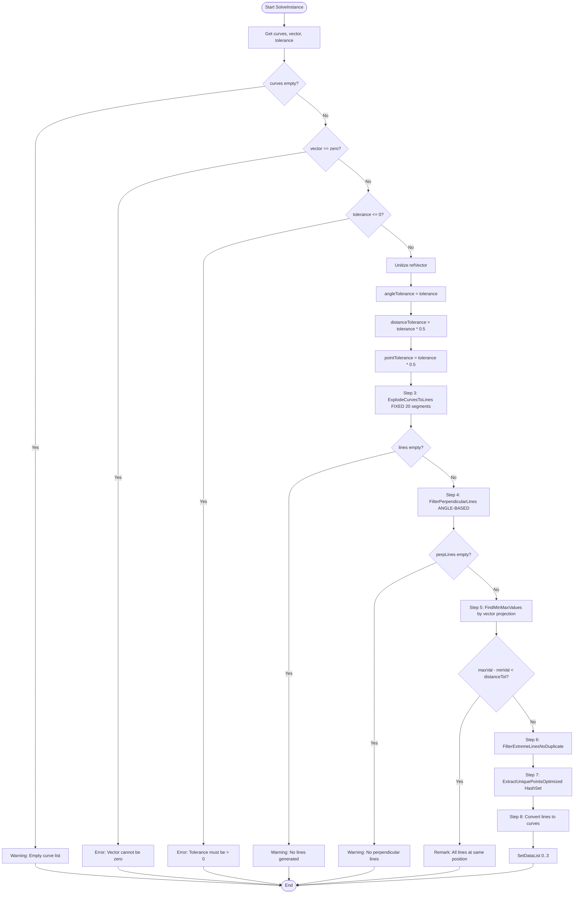

# ExplodeCurveAndPoints — Grasshopper Component Documentation (English)

---

## 1. Overview

| Field | Value |
|---|---|
| **Component Name** | Explode Curves and Points |
| **Nickname** | ExCur&Pts |
| **Description** | Identify Curves and Points at min max value with improved perpendicular check and optimized point extraction |
| **Category** | Mäkeläinen automation |
| **Subcategory** | Curves |
| **Class** | `ExtremeCurveAndPointsComponent : GH_Component` |
| **Namespace** | `MakelainenAutomation` |
| **GUID** | `90966CAB-582A-4D6E-94E2-906D85A932D7` |
| **Exposure** | `GH_Exposure.primary` |

---

## 2. Constants

```csharp
private const double DEFAULT_TOLERANCE = 0.02;  // default angle tolerance
private const double MIN_LENGTH = 0.001;         // minimum line length
private const int CURVE_DIV = 20;                // fixed curve divisions
```

---

## 3. Inputs & Outputs

### Inputs

| Index | Name | Nickname | Type | Access | Default | Description |
|---|---|---|---|---|---|---|
| 0 | Poly/Curves | PC | Curve | List | — | PolyCurves/Curves to analyze |
| 1 | Vector | V | Vector | Item | — | Reference direction vector |
| 2 | Tolerance | Tolerance | Number | Item | `0.02` | Angle tolerance (radians) |

### Outputs

| Index | Name | Nickname | Type | Access | Description |
|---|---|---|---|---|---|
| 0 | MinPoints | MinP | Point | List | Unique points at minimum extreme position |
| 1 | MaxPoints | MaxP | Point | List | Unique points at maximum extreme position |
| 2 | MinCurves | MinC | Curve | List | Curves at minimum extreme position |
| 3 | MaxCurves | MaxC | Curve | List | Curves at maximum extreme position |

---

## 4. Flowchart



---

## 5. Classes & Methods

### 5.1 Class: `ExtremeCurveAndPointsComponent`

```
ExtremeCurveAndPointsComponent
├── Constants
│   ├── DEFAULT_TOLERANCE = 0.02
│   ├── MIN_LENGTH = 0.001
│   └── CURVE_DIV = 20
│
├── SolveInstance()                      — main pipeline
│
├── Core Geometry
│   ├── ProjectOntoVector()              — pt.X*vec.X + pt.Y*vec.Y + pt.Z*vec.Z
│   └── CalculateDecimalPlaces()         — decimal places from tolerance
│
├── Curve Processing
│   └── ExplodeCurvesToLines()           — polyline or DivideByCount
│
├── Line Filtering
│   └── FilterPerpendicularLines()       — angle-based Acos check
│
├── Min/Max Finding
│   └── FindMinMaxValues()               — project all endpoints onto vector
│
├── Extreme Filtering
│   └── FilterExtremeLinesNoDuplicate()  — no-duplicate: assign to closer extreme
│
└── Point Extraction
    ├── ExtractUniquePointsOptimized()   — HashSet O(n) with custom comparer
    ├── RoundPoint()                     — Math.Round(x/y/z, decimals)
    └── Point3dRoundedComparer           — inner class for HashSet
```

---

### 5.2 Key Innovation: Angle-Based Perpendicular Check

Unlike `ExtremeCurveComponent` which checks the axis component directly, this component uses an angle-based approach:

```csharp
double dotProduct = Vector3d.Multiply(dir, refVector);
dotProduct = Math.Max(-1.0, Math.Min(1.0, dotProduct));  // clamp
double angle = Math.Acos(Math.Abs(dotProduct));
double deviationFromPerpendicular = Math.Abs(angle - Math.PI / 2);

if (deviationFromPerpendicular < angleTolerance)
    perpLines.Add(line);
```

This works for **any direction vector**, not just axis-aligned ones.

---

### 5.3 Key Innovation: No-Duplicate Extreme Filtering

```csharp
bool isNearMin = distToMin < distanceTolerance;
bool isNearMax = distToMax < distanceTolerance;

if (isNearMin && isNearMax)
{
    // Assign to closer one (FIX for ambiguous cases)
    if (distToMin <= distToMax) minLines.Add(line);
    else                        maxLines.Add(line);
}
```

---

### 5.4 Key Innovation: O(n) HashSet Point Extraction

```csharp
var uniquePoints = new HashSet<Point3d>(new Point3dRoundedComparer(tolerance, decimalPlaces));

foreach (Line line in lines)
{
    Point3d roundedFrom = RoundPoint(line.From, decimalPlaces);
    Point3d roundedTo = RoundPoint(line.To, decimalPlaces);
    uniquePoints.Add(roundedFrom);
    uniquePoints.Add(roundedTo);
}
```

`Point3dRoundedComparer` hashes by `Math.Round(coord / tolerance)` for consistent O(1) lookup.

---

## 6. Core Logic: Vector-Based Projection

```
Given: lines and refVector (unitized)

Project each endpoint onto refVector:
  projection = pt.X * vec.X + pt.Y * vec.Y + pt.Z * vec.Z

This gives a signed scalar — the "distance along the vector".

minVal = min of all projections
maxVal = max of all projections

Lines whose endpoints project near minVal → minLines
Lines whose endpoints project near maxVal → maxLines
```

---

## 7. Example Walkthrough

### Input

- Rectangular polyline at Z=0, reference Vector = (0, 0, 1) (upward Z)
- Tolerance = 0.02

### After Explode

- 4 line segments: bottom, top, left side, right side

### After Perpendicular Filter (vector=(0,0,1))

- Lines perpendicular to Z → horizontal lines (bottom, top, left, right have Z-component ≈ 0)

### After Projection

- All horizontal lines project to Z=0 → no range

In practice, use a meaningful vector like (1, 0, 0) for X-direction analysis.

---

## 8. Error & Warning Handling

| Condition | Type | Message |
|---|---|---|
| Empty curve list | Warning | "Empty curve list" |
| Zero vector | Error | "Vector cannot be zero!" |
| Tolerance ≤ 0 | Error | "Tolerance must be greater than 0" |
| No lines from explode | Warning | "No lines generated from curves" |
| No perpendicular lines | Warning | "No lines perpendicular to vector within tolerance" |
| All at same position | Remark | "All lines at same position along vector" |
| No extreme lines | Warning | "No extreme lines found" |

---

## 9. Key Differences from ExtremeCurve

| Feature | ExtremeCurve | ExplodeCurveAndPoints (this) |
|---|---|---|
| Axis input | String "x"/"y"/"z" | Vector3d (any direction) |
| Perpendicular check | Component < PERP_TOL | Acos angle from 90° |
| Point dedup | O(n²) linear scan | O(n) HashSet |
| Duplicate extreme | Can assign to both | Assigns to closer one |
| User tolerance | Fixed constants | Adjustable parameter |
| Decimal places | Fixed 1 decimal | Computed from tolerance |
