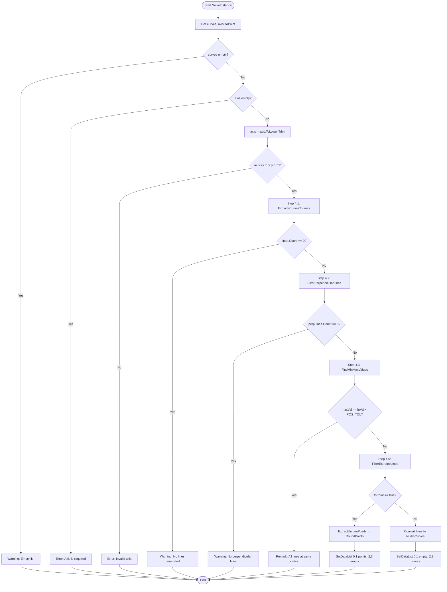

# ExtremeCurve — Grasshopper Component Documentation (English)

---

## 1. Overview

| Field | Value |
|---|---|
| **Component Name** | Extreme Curve and Points |
| **Nickname** | ExCur&Pts |
| **Description** | Finds extreme curves or points along X, Y, or Z axis by filtering perpendicular line segments |
| **Category** | Mäkeläinen automation |
| **Subcategory** | Curves |
| **Class** | `ExtremeCurveComponent : GH_Component` |
| **Namespace** | `ExtremeCurveAnalysis` |
| **GUID** | `C11F5962-A458-4176-BAB8-E42F3304A8C7` |
| **Exposure** | `GH_Exposure.primary` |

---

## 2. Constants

```csharp
const double PERP_TOL = 0.02;    // ~1 degree — perpendicular check tolerance
const double POS_TOL = 0.01;     // 10mm — position grouping tolerance
const double PT_TOL = 0.01;      // 10mm — duplicate point tolerance
const double MIN_LENGTH = 0.001; // minimum line length
const int CURVE_DIVISIONS = 20;  // divisions for complex curves
```

---

## 3. Inputs & Outputs

### Inputs

| Index | Name | Nickname | Type | Access | Default | Description |
|---|---|---|---|---|---|---|
| 0 | Curves | C | Curve | List | — | Input curves to analyze |
| 1 | Axis | A | Text | Item | — | Reference axis: 'x', 'y', or 'z' (REQUIRED) |
| 2 | ToPoint | P | Boolean | Item | `false` | If true → output points; if false → output curves |

> `ToPoint` is optional (`pManager[2].Optional = true`).

### Outputs

| Index | Name | Nickname | Type | Access | Description |
|---|---|---|---|---|---|
| 0 | Min Points | MinP | Point | List | Points at minimum axis position (rounded to 1 decimal, if ToPoint=true) |
| 1 | Max Points | MaxP | Point | List | Points at maximum axis position (rounded to 1 decimal, if ToPoint=true) |
| 2 | Min Curves | MinC | Curve | List | Curves at minimum axis position (if ToPoint=false) |
| 3 | Max Curves | MaxC | Curve | List | Curves at maximum axis position (if ToPoint=false) |

---

## 4. Flowchart



---

## 5. Classes & Methods

### 5.1 Class: `ExtremeCurveComponent`

```
ExtremeCurveComponent
├── Constants (local in SolveInstance)
│   ├── PERP_TOL = 0.02
│   ├── POS_TOL = 0.01
│   ├── PT_TOL = 0.01
│   ├── MIN_LENGTH = 0.001
│   └── CURVE_DIVISIONS = 20
│
├── Constructor
│   └── ExtremeCurveComponent()
│
└── Methods
    ├── SolveInstance()          — main pipeline
    ├── RoundPoints()            — Math.Round(x/y/z, 1)
    ├── ExplodeCurvesToLines()   — polyline.GetSegments or DivideByCount
    ├── FilterPerpendicularLines() — axis component < PERP_TOL
    ├── FindMinMaxValues()       — LINQ Min/Max on all endpoint coords
    ├── FilterExtremeLines()     — abs(coord - minVal/maxVal) < POS_TOL
    ├── ExtractUniquePoints()    — O(n²) dedup via HasPoint
    ├── GetCoord()               — point.X/Y/Z by axis string
    ├── GetAxisComponent()       — vector.X/Y/Z by axis string
    └── HasPoint()               — list.Any(p => distanceTo < tol)
```

---

### 5.2 Key Method: `FilterPerpendicularLines`

A line is **perpendicular to axis** if its component along that axis is near-zero:

```csharp
Vector3d dir = ln.Direction;
dir.Unitize();
double component = GetAxisComponent(dir, axis);
if (Math.Abs(component) < PERP_TOL)
    result.Add(ln);
```

For axis "x": lines with near-zero X component are perpendicular to X.

---

### 5.3 Key Method: `FilterExtremeLines`

```csharp
double lnMin = Math.Min(GetCoord(ln.From, axis), GetCoord(ln.To, axis));
double lnMax = Math.Max(GetCoord(ln.From, axis), GetCoord(ln.To, axis));

if (Math.Abs(lnMin - minVal) < POS_TOL || Math.Abs(lnMax - minVal) < POS_TOL)
    minLines.Add(ln);
if (Math.Abs(lnMin - maxVal) < POS_TOL || Math.Abs(lnMax - maxVal) < POS_TOL)
    maxLines.Add(ln);
```

Note: A line can appear in both minLines and maxLines.

---

## 6. Core Logic

```
Pipeline:
1. Explode curves → line segments
   - Polylines: GetSegments()
   - Complex curves: DivideByCount(20) → Line segments

2. Filter perpendicular lines
   - Unitize direction vector
   - Check: |dir.{axis}| < PERP_TOL (0.02 ≈ 1 degree)

3. Find min/max coordinate along axis
   - Scan all endpoints of perpendicular lines
   - minVal = min of all coords, maxVal = max

4. Filter extreme lines
   - Lines whose endpoints touch minVal or maxVal (within POS_TOL)

5. Output:
   - ToPoint=true: extract unique points (rounded to 1 decimal)
   - ToPoint=false: convert Line → NurbsCurve
```

---

## 7. Example Walkthrough

### Input

- A rectangular polyline (4 segments), axis = "z", ToPoint = false

### After Explode

- 4 line segments: bottom, top, left, right

### After Perpendicular Filter (axis="z")

- Lines with near-zero Z component → bottom and top horizontal lines

### After FindMinMax

- minVal = 0.0 (bottom Z), maxVal = 3.0 (top Z)

### After FilterExtremeLines

- minLines = [bottom line], maxLines = [top line]

### Output

- MinC = [bottom curve], MaxC = [top curve]

---

## 8. Error & Warning Handling

| Condition | Type | Message |
|---|---|---|
| Empty curves list | Warning | "Empty list" |
| Axis not provided | Error | "Axis is required! Please specify 'x', 'y', or 'z'" |
| Invalid axis value | Error | "Invalid axis. Use 'x', 'y', or 'z'" |
| No lines from explode | Warning | "No lines generated from curves" |
| No perpendicular lines | Warning | "No lines perpendicular to axis {axis}" |
| All lines at same position | Remark | "All lines at same position ({axis} = {minVal})" |
| No extreme lines found | Warning | "No extreme lines found" |

---

## 9. Difference from ExplodeCurveAndPoints

| Feature | ExtremeCurve (this) | ExplodeCurveAndPoints |
|---|---|---|
| Axis input | String "x"/"y"/"z" | Vector3d |
| Perpendicular check | Component < PERP_TOL (0.02) | Angle from 90° via Acos |
| Point dedup | O(n²) linear scan | O(n) HashSet with custom comparer |
| Tolerance | Fixed constants in code | User-adjustable parameter |
| No-duplicate extreme | Can duplicate min/max | FIX: assigns to closer one |
