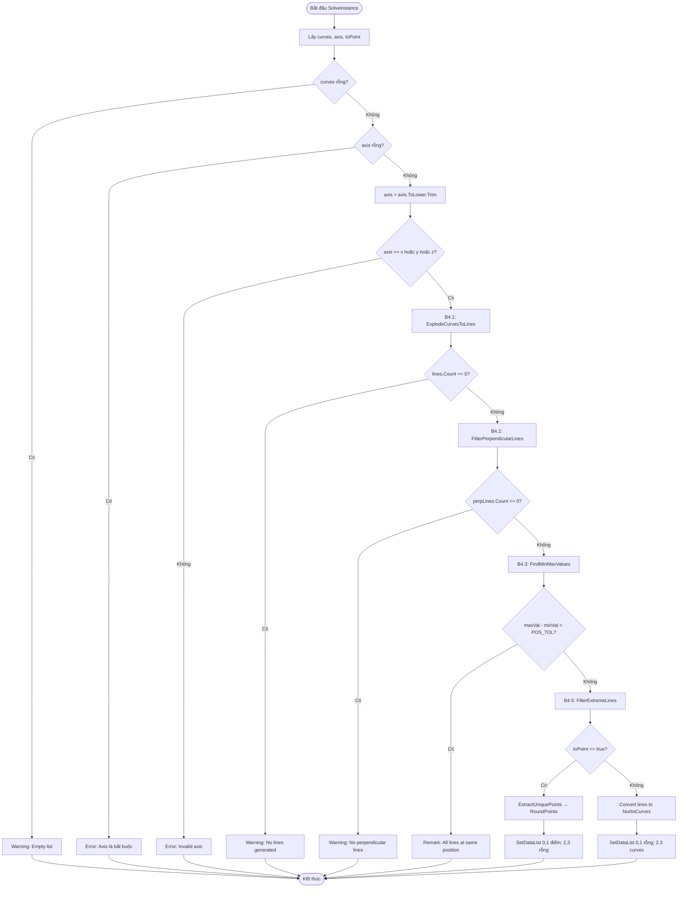

# ExtremeCurve — Tài liệu Grasshopper Component (Tiếng Việt)

---

## 1. Tổng quan

| Trường | Giá trị |
|---|---|
| **Tên Component** | Extreme Curve and Points |
| **Nickname** | ExCur&Pts |
| **Mô tả** | Tìm curves/points ở vị trí cực trị theo trục X, Y, hoặc Z |
| **Danh mục** | Mäkeläinen automation |
| **Danh mục con** | Curves |
| **Class** | `ExtremeCurveComponent : GH_Component` |
| **Namespace** | `ExtremeCurveAnalysis` |
| **GUID** | `C11F5962-A458-4176-BAB8-E42F3304A8C7` |
| **Exposure** | `GH_Exposure.primary` |

---

## 2. Hằng số Cục bộ (trong SolveInstance)

```csharp
const double PERP_TOL = 0.02;    // ~1 độ — dung sai kiểm tra vuông góc
const double POS_TOL = 0.01;     // 10mm — nhóm theo vị trí
const double PT_TOL = 0.01;      // 10mm — loại bỏ điểm trùng
const double MIN_LENGTH = 0.001; // độ dài đường tối thiểu
const int CURVE_DIVISIONS = 20;  // số phân chia cho đường cong phức tạp
```

---

## 3. Đầu vào & Đầu ra

### Đầu vào (Inputs)

| Chỉ số | Tên | Nickname | Kiểu | Access | Mặc định | Mô tả |
|---|---|---|---|---|---|---|
| 0 | Curves | C | Curve | List | — | Curves cần phân tích |
| 1 | Axis | A | Text | Item | — | Trục tham chiếu: 'x', 'y', hoặc 'z' (BẮT BUỘC) |
| 2 | ToPoint | P | Boolean | Item | `false` | true → xuất điểm; false → xuất curves |

> `ToPoint` là tùy chọn (`pManager[2].Optional = true`).

### Đầu ra (Outputs)

| Chỉ số | Tên | Nickname | Kiểu | Access | Mô tả |
|---|---|---|---|---|---|
| 0 | Min Points | MinP | Point | List | Điểm ở vị trí nhỏ nhất (làm tròn 1 số thập phân, khi ToPoint=true) |
| 1 | Max Points | MaxP | Point | List | Điểm ở vị trí lớn nhất (làm tròn 1 số thập phân, khi ToPoint=true) |
| 2 | Min Curves | MinC | Curve | List | Curves ở vị trí nhỏ nhất (khi ToPoint=false) |
| 3 | Max Curves | MaxC | Curve | List | Curves ở vị trí lớn nhất (khi ToPoint=false) |

---

## 4. Sơ đồ luồng (Flowchart)



---

## 5. Logic Cốt lõi

### Bước 1: Nổ curves thành line segments

```
- Polyline → GetSegments()
- Curve phức tạp → DivideByCount(20) → tạo Line segments
```

### Bước 2: Lọc các line vuông góc với trục

```csharp
Vector3d dir = ln.Direction;
dir.Unitize();
double component = GetAxisComponent(dir, axis);
// axis="z" → component = dir.Z
if (Math.Abs(component) < 0.02)  // gần 0 → vuông góc với trục Z
    result.Add(ln);
```

### Bước 3: Tìm min/max

```
minVal = min(tất cả tọa độ trục của endpoints của perpLines)
maxVal = max(tương tự)
```

### Bước 4: Lọc extreme lines

```
if |endpoint_coord - minVal| < POS_TOL → minLines
if |endpoint_coord - maxVal| < POS_TOL → maxLines
```

### Bước 5: Xuất output

```
ToPoint=true → trích xuất điểm duy nhất, làm tròn 1 số thập phân
ToPoint=false → convert Line → NurbsCurve
```

---

## 6. Ví dụ Thực tế

### Đầu vào

- Một polyline hình chữ nhật (4 đoạn), axis = "z", ToPoint = false

### Sau khi Nổ

- 4 đoạn thẳng: đáy, đỉnh, trái, phải

### Sau khi Lọc Vuông Góc (axis="z")

- Lines có thành phần Z gần 0 → đường nằm ngang (đáy và đỉnh)

### Sau FindMinMax

- minVal = 0.0 (Z của đáy), maxVal = 3.0 (Z của đỉnh)

### Kết quả

- MinC = [đường đáy], MaxC = [đường đỉnh]

---

## 7. Xử lý Lỗi & Cảnh báo

| Điều kiện | Loại | Thông báo |
|---|---|---|
| Danh sách curves rỗng | Warning | "Empty list" |
| Axis không được cung cấp | Error | "Axis is required! Please specify 'x', 'y', or 'z'" |
| Axis không hợp lệ | Error | "Invalid axis. Use 'x', 'y', or 'z'" |
| Không có lines từ nổ curve | Warning | "No lines generated from curves" |
| Không có lines vuông góc | Warning | "No lines perpendicular to axis {axis}" |
| Tất cả lines ở cùng vị trí | Remark | "All lines at same position" |

---

## 8. So sánh với ExplodeCurveAndPoints

| Đặc điểm | ExtremeCurve (này) | ExplodeCurveAndPoints |
|---|---|---|
| Đầu vào trục | String "x"/"y"/"z" | Vector3d |
| Kiểm tra vuông góc | Component < PERP_TOL (0.02) | Góc lệch từ 90° qua Acos |
| Loại điểm trùng | O(n²) quét tuyến tính | O(n) HashSet với custom comparer |
| Dung sai | Hằng số cố định trong code | Tham số người dùng điều chỉnh được |
