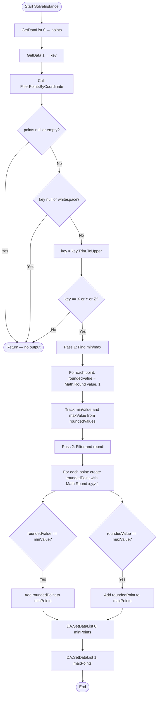

# GroupPoint_XY — Grasshopper Component Documentation (English)

---

## 1. Overview

| Field | Value |
|---|---|
| **Component Name** | GroupPoint_XY |
| **Nickname** | GroupPts |
| **Description** | Grouped and min or max sorted Points following Keygen |
| **Category** | Mäkeläinen automation |
| **Subcategory** | Points |
| **Class** | `PointMinMaxFilterByCoordinate : GH_Component` |
| **Namespace** | `GroupPoint_XY` |
| **GUID** | `911ac5e5-5093-4256-8a0d-1a1b032f300a` |
| **Exposure** | `GH_Exposure.primary` |

---

## 2. Purpose

Filters a list of points to extract those at the minimum and maximum coordinate value along a specified axis (X, Y, or Z). All output points have their coordinates rounded to 1 decimal place.

---

## 3. Inputs & Outputs

### Inputs

| Index | Name | Nickname | Type | Access | Default | Description |
|---|---|---|---|---|---|---|
| 0 | PointsList | Pts | Point | List | — | Input points |
| 1 | Axis | Axis | Text | Item | — | Axis key: "X", "Y", or "Z" |

### Outputs

| Index | Name | Nickname | Type | Access | Description |
|---|---|---|---|---|---|
| 0 | Min Point List | MinPts | Point | List | Points at minimum coordinate value (rounded to 1 decimal) |
| 1 | Max Point List | MaxPts | Point | List | Points at maximum coordinate value (rounded to 1 decimal) |

---

## 4. Flowchart



---

## 5. Classes & Methods

### 5.1 Class: `PointMinMaxFilterByCoordinate`

```
PointMinMaxFilterByCoordinate
├── Constructor
│   └── PointMinMaxFilterByCoordinate() — sets Name, Nickname, Category, Subcategory
│
├── Properties
│   ├── Exposure        — GH_Exposure.primary
│   ├── Icon            — Resources.GroupPOint
│   └── ComponentGuid   — 911ac5e5-5093-4256-8a0d-1a1b032f300a
│
├── Override Methods
│   ├── RegisterInputParams()  — PointsList (list), Axis (item)
│   ├── RegisterOutputParams() — Min Point List (list), Max Point List (list)
│   └── SolveInstance()        — get inputs → FilterPointsByCoordinate → set outputs
│
└── Helper Methods
    ├── FilterPointsByCoordinate()  — core 2-pass algorithm
    └── GetCoordinateValue()        — returns point.X, point.Y, or point.Z based on key
```

---

### 5.2 Method: `FilterPointsByCoordinate`

**Signature:** `private void FilterPointsByCoordinate(List<Point3d> points, string key, out List<Point3d> minPoints, out List<Point3d> maxPoints)`

**Algorithm (2-pass):**

**Pass 1 — Find min/max:**
```csharp
double roundedValue = Math.Round(value, 1);
roundedValues.Add(roundedValue);
if (roundedValue < minValue) minValue = roundedValue;
if (roundedValue > maxValue) maxValue = roundedValue;
```

**Pass 2 — Filter and round:**
```csharp
Point3d roundedPoint = new Point3d(
    Math.Round(point.X, 1),
    Math.Round(point.Y, 1),
    Math.Round(point.Z, 1)
);
if (roundedValue == minValue) minPoints.Add(roundedPoint);
if (roundedValue == maxValue) maxPoints.Add(roundedPoint);
```

> **Key insight:** The axis comparison uses `Math.Round(value, 1)` — so points within 0.1 units of each other along the axis are considered the same level.

---

## 6. Core Logic

```
Given: List of points, axis key = "X"/"Y"/"Z"

Pass 1:
  For each point:
    value = point.X (or .Y or .Z based on key)
    roundedValue = Math.Round(value, 1)
    update min/max from roundedValue

Pass 2:
  For each point:
    roundedPoint = Point3d(Round(X,1), Round(Y,1), Round(Z,1))
    if roundedValue == minValue → add to minPoints
    if roundedValue == maxValue → add to maxPoints
```

**Important:** A point can appear in BOTH minPoints AND maxPoints if there is only one distinct level (all points at same rounded coordinate).

---

## 7. Example Walkthrough

### Input

- Points: (0, 1.5, 0), (5, 1.6, 0), (10, 3.0, 0), (3, 3.05, 0)
- Axis: "Y"

### Pass 1

| Point | Y value | Rounded(1) |
|---|---|---|
| (0, 1.5, 0) | 1.5 | 1.5 |
| (5, 1.6, 0) | 1.6 | 1.6 |
| (10, 3.0, 0) | 3.0 | 3.0 |
| (3, 3.05, 0) | 3.05 | 3.1 |

→ minValue = 1.5, maxValue = 3.1

### Pass 2

| Point | Rounded | → |
|---|---|---|
| (0.0, 1.5, 0.0) | 1.5 = min | **MinPts** |
| (5.0, 1.6, 0.0) | 1.6 (neither) | — |
| (10.0, 3.0, 0.0) | 3.0 (neither) | — |
| (3.0, 3.1, 0.0) | 3.1 = max | **MaxPts** |

---

## 8. Error & Warning Handling

| Condition | Type | Message |
|---|---|---|
| Points list null/empty | Silent return | (no output) |
| Key null/empty/whitespace | Silent return | (no output) |
| Key not "X", "Y", or "Z" | Silent return | (no output) |

---

## 9. Important Notes

- **Rounding to 1 decimal:** Both the comparison key AND the output points are rounded. This ensures tolerance-aware grouping.
- **No error messages:** All invalid input cases return silently with null outputs.
- **Both min and max possible:** A point meeting BOTH conditions (only 1 unique level) appears in both output lists.
