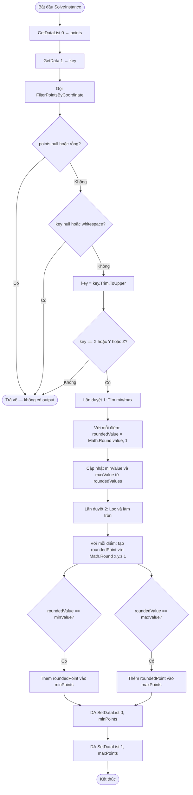

# GroupPoint_XY — Tài liệu Grasshopper Component (Tiếng Việt)

---

## 1. Tổng quan

| Trường | Giá trị |
|---|---|
| **Tên Component** | GroupPoint_XY |
| **Nickname** | GroupPts |
| **Mô tả** | Grouped and min or max sorted Points following Keygen |
| **Danh mục** | Mäkeläinen automation |
| **Danh mục con** | Points |
| **Class** | `PointMinMaxFilterByCoordinate : GH_Component` |
| **Namespace** | `GroupPoint_XY` |
| **GUID** | `911ac5e5-5093-4256-8a0d-1a1b032f300a` |
| **Exposure** | `GH_Exposure.primary` |

---

## 2. Mục đích

Lọc danh sách điểm để trích xuất các điểm có giá trị tọa độ nhỏ nhất và lớn nhất theo trục chỉ định (X, Y hoặc Z). Tất cả điểm đầu ra được làm tròn đến 1 số thập phân.

---

## 3. Đầu vào & Đầu ra

### Đầu vào (Inputs)

| Chỉ số | Tên | Nickname | Kiểu | Access | Mặc định | Mô tả |
|---|---|---|---|---|---|---|
| 0 | PointsList | Pts | Point | List | — | Danh sách điểm đầu vào |
| 1 | Axis | Axis | Text | Item | — | Trục: "X", "Y", hoặc "Z" |

### Đầu ra (Outputs)

| Chỉ số | Tên | Nickname | Kiểu | Access | Mô tả |
|---|---|---|---|---|---|
| 0 | Min Point List | MinPts | Point | List | Điểm có giá trị tọa độ nhỏ nhất (làm tròn 1 số thập phân) |
| 1 | Max Point List | MaxPts | Point | List | Điểm có giá trị tọa độ lớn nhất (làm tròn 1 số thập phân) |

---

## 4. Sơ đồ luồng (Flowchart)



---

## 5. Logic Cốt lõi

```
Đầu vào: Danh sách điểm, axis key = "X"/"Y"/"Z"

Lần duyệt 1:
  Với mỗi điểm:
    value = point.X (hoặc .Y hoặc .Z theo key)
    roundedValue = Math.Round(value, 1)
    cập nhật min/max từ roundedValue

Lần duyệt 2:
  Với mỗi điểm:
    roundedPoint = Point3d(Round(X,1), Round(Y,1), Round(Z,1))
    if roundedValue == minValue → thêm vào minPoints
    if roundedValue == maxValue → thêm vào maxPoints
```

**Điểm quan trọng:** Phép so sánh trục dùng `Math.Round(value, 1)` — các điểm cách nhau trong vòng 0.1 đơn vị theo trục được coi là cùng mức.

---

## 6. Ví dụ Thực tế

### Đầu vào

- Điểm: (0, 1.5, 0), (5, 1.6, 0), (10, 3.0, 0), (3, 3.05, 0)
- Axis: "Y"

### Lần duyệt 1

| Điểm | Giá trị Y | Làm tròn(1) |
|---|---|---|
| (0, 1.5, 0) | 1.5 | 1.5 |
| (5, 1.6, 0) | 1.6 | 1.6 |
| (10, 3.0, 0) | 3.0 | 3.0 |
| (3, 3.05, 0) | 3.05 | 3.1 |

→ minValue = 1.5, maxValue = 3.1

### Lần duyệt 2

| Điểm | Làm tròn | → |
|---|---|---|
| (0.0, 1.5, 0.0) | 1.5 = min | **MinPts** |
| (5.0, 1.6, 0.0) | 1.6 (không) | — |
| (10.0, 3.0, 0.0) | 3.0 (không) | — |
| (3.0, 3.1, 0.0) | 3.1 = max | **MaxPts** |

---

## 7. Xử lý Lỗi & Cảnh báo

| Điều kiện | Loại | Thông báo |
|---|---|---|
| Danh sách điểm null/rỗng | Trả về im lặng | (không có output) |
| Key null/rỗng/whitespace | Trả về im lặng | (không có output) |
| Key không phải "X", "Y", "Z" | Trả về im lặng | (không có output) |

---

## 8. Lưu ý Quan trọng

- **Làm tròn 1 số thập phân:** Cả khóa so sánh lẫn điểm đầu ra đều được làm tròn. Điều này đảm bảo nhóm theo ngưỡng dung sai.
- **Không có thông báo lỗi:** Tất cả trường hợp input không hợp lệ đều trả về im lặng với output null.
- **Có thể xuất hiện ở cả min và max:** Nếu chỉ có 1 mức giá trị duy nhất, cùng một điểm sẽ xuất hiện ở cả hai danh sách đầu ra.
