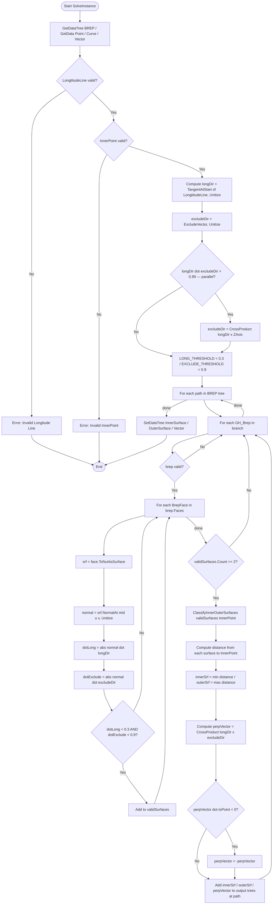

# IdentifySurfaces — Grasshopper Component Documentation (English)

> **Reuse Template:** Dot-product surface filtering + inner/outer classification by closest-point distance. Pattern for any BREP face analysis component.

---

## 1. Overview

| Field | Value |
|---|---|
| **Component Name** | Identify Surfaces |
| **Nickname** | SrfClass |
| **Description** | Specified Inner/Outer surfaces |
| **Category** | Mäkeläinen automation |
| **Subcategory** | Geometry |
| **Class** | `SurfaceClassifier : GH_Component` |
| **Namespace** | `SurfaceClassification` |
| **GUID** | `F8029F3C-A60D-4AD2-A126-F34F1640EF18` |
| **Exposure** | `GH_Exposure.primary` |

---

## 2. Inputs & Outputs

### Inputs

| Index | Name | Nickname | Type | Access | Description |
|---|---|---|---|---|---|
| 0 | BREP | BREP | Brep | Tree | 3D BREPs to analyse |
| 1 | Reference Point | Point | Point | Item | Inner reference point for inner/outer classification |
| 2 | LongtitudeLine | LongtitudeLine | Curve | Item | Longitudinal axis line of the BREP |
| 3 | ExcludeVector | ExcludeVector | Vector | Item | Vector to exclude (e.g. vertical faces) |

### Outputs

| Index | Name | Nickname | Type | Access | Description |
|---|---|---|---|---|---|
| 0 | InnerSurface | InnerSurface | Surface | Tree | Inner surfaces (closest to reference point) |
| 1 | OuterSurface | OuterSurface | Surface | Tree | Outer surfaces (farthest from reference point) |
| 2 | Vector | Vector | Vector | Tree | Perpendicular direction vectors from inner surface to reference point |

---

## 3. Flowchart



---

## 4. Classes & Methods

### 4.1 Class: `SurfaceClassifier`

```
SurfaceClassifier
├── Constructor
│   └── SurfaceClassifier() — Name, Nickname, Category, Subcategory
│
├── Properties
│   ├── Exposure      — GH_Exposure.primary
│   ├── Icon          — Resources.IdentifySurfaces
│   └── ComponentGuid — F8029F3C-A60D-4AD2-A126-F34F1640EF18
│
├── Override Methods
│   ├── RegisterInputParams()  — BREP (tree), Point (item), Curve (item), Vector (item)
│   ├── RegisterOutputParams() — InnerSurface (tree), OuterSurface (tree), Vector (tree)
│   └── SolveInstance()        — main pipeline
│
└── Helper Methods
    └── ClassifyInnerOuterSurfaces() — closest-point distance for inner/outer classification
```

---

### 4.2 Method: `ClassifyInnerOuterSurfaces`

**Signature:** `private Tuple<Surface, Surface, double, double> ClassifyInnerOuterSurfaces(List<Surface> surfaces, Point3d referencePoint)`

**Algorithm:**
1. For each surface, call `srf.ClosestPoint(referencePoint, out u, out v)`
2. Compute `dist = referencePoint.DistanceTo(srf.PointAt(u, v))`
3. Skip surfaces where ClosestPoint fails, or dist is NaN/Infinity
4. `innerSrf` = surface with **minimum** distance → closest to reference point = inner face
5. `outerSrf` = surface with **maximum** distance → farthest from reference point = outer face
6. Returns `Tuple<innerSrf, outerSrf, minDist, maxDist>` or `null` if < 2 valid surfaces

---

## 5. Core Logic

### 5.1 Surface Filtering (Dot Product Thresholds)

```csharp
const double LONG_THRESHOLD    = 0.3;  // exclude faces nearly parallel to longDir
const double EXCLUDE_THRESHOLD = 0.9;  // exclude faces nearly parallel to excludeDir

// Only keep faces that are:
// - NOT parallel to the longitudinal axis (dotLong < 0.3)
// - NOT parallel to the exclude direction (dotExclude < 0.9)
if (dotLong < LONG_THRESHOLD && dotExclude < EXCLUDE_THRESHOLD)
    validSurfaces.Add(srf);
```

**Intent:** Filter out end-cap faces (parallel to longitudinal axis) and top/bottom faces (parallel to ExcludeVector), keeping only the side faces (inner/outer walls).

---

### 5.2 Parallel Vector Guard

When `longDir` and `excludeDir` are nearly parallel (dot > 0.99), the cross product would be near-zero. The component substitutes a perpendicular vector:

```csharp
if (parallelCheck > 0.99)
    excludeDir = CrossProduct(longDir, ZAxis);
    if (excludeDir.Length < 0.001) excludeDir = Vector3d.XAxis;
```

---

### 5.3 Output Vector Direction

The output vector is oriented to point **from inner surface toward the reference point**:

```csharp
Vector3d perpVector = CrossProduct(longDir, excludeDir);
Vector3d toPoint = InnerPoint - innerCenter;  // direction from inner face to reference
double dotCheck = Multiply(perpVector, toPoint);
if (dotCheck < 0) perpVector = -perpVector;  // flip if wrong direction
```

---

## 6. Example Walkthrough

### Setup

- BREP: A rectangular hollow steel section (HSS tube)
- Reference Point: a point **inside** the tube cavity
- LongtitudeLine: a line along the tube's long axis (Z direction)
- ExcludeVector: (0, 0, 1) — vertical, to exclude end caps and top/bottom

### Filter Pass

Each face normal is tested:
- Top/bottom faces: normal ≈ (0,0,1) → dotExclude ≈ 1.0 → **excluded** (≥ 0.9)
- End cap faces: normal ≈ (0,0,1) aligned with longDir → dotLong ≈ 1.0 → **excluded** (≥ 0.3)
- Left/right/front/back side faces: dotLong < 0.3, dotExclude < 0.9 → **kept**

### Classification

From the 4 kept side faces (inner wall + outer wall × 2 pairs):
- The face closest to InnerPoint → **InnerSurface**
- The face farthest → **OuterSurface**

### Output Vector

- Computed as `CrossProduct(longDir, excludeDir)` then flipped to point inward

---

## 7. Error & Warning Handling

| Condition | Type | Message |
|---|---|---|
| LongtitudeLine null or invalid | Error | "Invalid Longitude Line" |
| InnerPoint invalid | Error | "Invalid InnerPoint" |
| brep null or invalid | Silent skip | (continue to next BREP) |
| face → NurbsSurface fails | Silent skip | (continue to next face) |
| ClosestPoint fails or NaN dist | Silent skip | (excluded from distances) |
| validSurfaces.Count < 2 | Silent skip | (branch skipped) |
| ClassifyInnerOuterSurfaces returns null | Silent skip | (branch skipped) |

---

## 8. Key Constants

| Constant | Value | Purpose |
|---|---|---|
| `LONG_THRESHOLD` | `0.3` | Max dot product with longitudinal axis to include a face |
| `EXCLUDE_THRESHOLD` | `0.9` | Max dot product with exclude vector to include a face |
| Parallel guard | `0.99` | Threshold to detect parallel longDir / excludeDir |
| Zero-length guard | `0.001` | Threshold for near-zero vectors |

---

## 9. Reuse Template

```csharp
// Pattern: filter BREP faces by two dot-product thresholds
const double LONG_THRESHOLD    = 0.3;
const double EXCLUDE_THRESHOLD = 0.9;

foreach (BrepFace face in brep.Faces)
{
    Surface srf = face.ToNurbsSurface();
    double u = srf.Domain(0).Mid, v = srf.Domain(1).Mid;
    Vector3d normal = srf.NormalAt(u, v);
    normal.Unitize();

    double dotLong    = Math.Abs(Vector3d.Multiply(normal, longDir));
    double dotExclude = Math.Abs(Vector3d.Multiply(normal, excludeDir));

    if (dotLong < LONG_THRESHOLD && dotExclude < EXCLUDE_THRESHOLD)
        validSurfaces.Add(srf);
}

// Pattern: classify inner/outer by closest-point distance
var distances = new Dictionary<int, double>();
for (int i = 0; i < surfaces.Count; i++)
{
    double u, v;
    if (!surfaces[i].ClosestPoint(referencePoint, out u, out v)) continue;
    double dist = referencePoint.DistanceTo(surfaces[i].PointAt(u, v));
    if (!double.IsNaN(dist)) distances[i] = dist;
}
int innerIdx = distances.OrderBy(kvp => kvp.Value).First().Key;   // min dist
int outerIdx = distances.OrderBy(kvp => kvp.Value).Last().Key;    // max dist
```
