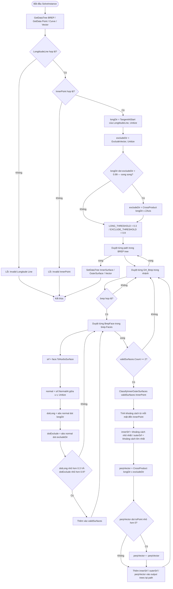

# IdentifySurfaces — Tài liệu Grasshopper Component (Tiếng Việt)

> **Mẫu Tái sử dụng:** Lọc mặt BREP bằng dot product + phân loại inner/outer theo khoảng cách closest-point. Dùng làm mẫu cho mọi component phân tích BrepFace.

---

## 1. Tổng quan

| Trường | Giá trị |
|---|---|
| **Tên Component** | Identify Surfaces |
| **Nickname** | SrfClass |
| **Mô tả** | Xác định mặt trong/ngoài (Inner/Outer) của BREP |
| **Danh mục** | Mäkeläinen automation |
| **Danh mục con** | Geometry |
| **Class** | `SurfaceClassifier : GH_Component` |
| **Namespace** | `SurfaceClassification` |
| **GUID** | `F8029F3C-A60D-4AD2-A126-F34F1640EF18` |
| **Exposure** | `GH_Exposure.primary` |

---

## 2. Đầu vào & Đầu ra

### Đầu vào (Inputs)

| Chỉ số | Tên | Nickname | Kiểu | Access | Mô tả |
|---|---|---|---|---|---|
| 0 | BREP | BREP | Brep | Tree | BREP 3D cần phân tích |
| 1 | Reference Point | Point | Point | Item | Điểm tham chiếu bên trong để phân loại inner/outer |
| 2 | LongtitudeLine | LongtitudeLine | Curve | Item | Đường trục dọc của BREP |
| 3 | ExcludeVector | ExcludeVector | Vector | Item | Vector loại trừ (ví dụ: hướng thẳng đứng để loại mặt đầu) |

### Đầu ra (Outputs)

| Chỉ số | Tên | Nickname | Kiểu | Access | Mô tả |
|---|---|---|---|---|---|
| 0 | InnerSurface | InnerSurface | Surface | Tree | Mặt trong (gần điểm tham chiếu nhất) |
| 1 | OuterSurface | OuterSurface | Surface | Tree | Mặt ngoài (xa điểm tham chiếu nhất) |
| 2 | Vector | Vector | Vector | Tree | Vector vuông góc từ mặt trong hướng về điểm tham chiếu |

---

## 3. Sơ đồ luồng (Flowchart)



---

## 4. Classes & Methods

### 4.1 Class: `SurfaceClassifier`

```
SurfaceClassifier
├── Constructor
│   └── SurfaceClassifier() — Name, Nickname, Category, Subcategory
│
├── Properties
│   ├── Exposure      — GH_Exposure.primary
│   ├── Icon          — Resources.IdentifySurfaces
│   └── ComponentGuid — F8029F3C-A60D-4AD2-A126-F34F1640EF18
│
├── Override Methods
│   ├── RegisterInputParams()  — BREP (tree), Point (item), Curve (item), Vector (item)
│   ├── RegisterOutputParams() — InnerSurface (tree), OuterSurface (tree), Vector (tree)
│   └── SolveInstance()        — pipeline chính
│
└── Helper Methods
    └── ClassifyInnerOuterSurfaces() — tính khoảng cách closest-point để phân loại
```

---

### 4.2 Method: `ClassifyInnerOuterSurfaces`

**Chữ ký:** `private Tuple<Surface, Surface, double, double> ClassifyInnerOuterSurfaces(List<Surface> surfaces, Point3d referencePoint)`

**Thuật toán:**
1. Với mỗi mặt, gọi `srf.ClosestPoint(referencePoint, out u, out v)`
2. Tính `dist = referencePoint.DistanceTo(srf.PointAt(u, v))`
3. Bỏ qua mặt nếu ClosestPoint thất bại, hoặc dist là NaN/Infinity
4. `innerSrf` = mặt có **khoảng cách nhỏ nhất** → gần điểm tham chiếu nhất = mặt trong
5. `outerSrf` = mặt có **khoảng cách lớn nhất** → xa nhất = mặt ngoài
6. Trả về `Tuple<innerSrf, outerSrf, minDist, maxDist>` hoặc `null` nếu < 2 mặt hợp lệ

---

## 5. Logic Cốt lõi

### 5.1 Lọc Mặt bằng Ngưỡng Dot Product

```csharp
const double LONG_THRESHOLD    = 0.3;  // loại mặt gần song song với trục dọc
const double EXCLUDE_THRESHOLD = 0.9;  // loại mặt gần song song với ExcludeVector

// Chỉ giữ lại mặt thỏa mãn:
// - KHÔNG song song với trục dọc (dotLong < 0.3)
// - KHÔNG song song với hướng loại trừ (dotExclude < 0.9)
if (dotLong < LONG_THRESHOLD && dotExclude < EXCLUDE_THRESHOLD)
    validSurfaces.Add(srf);
```

**Mục đích:** Loại bỏ mặt đầu cuối (song song với trục dọc) và mặt trên/dưới (song song với ExcludeVector), giữ lại chỉ các mặt cạnh (tường trong/ngoài).

---

### 5.2 Bảo vệ Vector Song Song

Khi `longDir` và `excludeDir` gần song song (dot > 0.99), tích chéo gần bằng 0. Component thay thế bằng vector vuông góc:

```csharp
if (parallelCheck > 0.99)
{
    excludeDir = CrossProduct(longDir, ZAxis);
    if (excludeDir.Length < 0.001) excludeDir = Vector3d.XAxis;
}
```

---

### 5.3 Hướng Vector Đầu ra

Vector đầu ra được định hướng **từ mặt trong về phía điểm tham chiếu**:

```csharp
Vector3d perpVector = CrossProduct(longDir, excludeDir);
Vector3d toPoint = InnerPoint - innerCenter;  // hướng từ mặt trong đến điểm tham chiếu
double dotCheck = Multiply(perpVector, toPoint);
if (dotCheck < 0) perpVector = -perpVector;  // lật nếu sai hướng
```

---

## 6. Ví dụ Thực tế

### Thiết lập

- BREP: Một đoạn thép hộp rỗng (ống HSS)
- Reference Point: điểm **bên trong** lòng ống
- LongtitudeLine: đường dọc theo trục dài của ống (hướng Z)
- ExcludeVector: (0, 0, 1) — thẳng đứng, để loại mặt đầu và mặt trên/dưới

### Lượt Lọc

Mỗi pháp tuyến mặt được kiểm tra:
- Mặt trên/dưới: normal ≈ (0,0,1) → dotExclude ≈ 1.0 → **loại** (≥ 0.9)
- Mặt đầu cuối: normal ≈ theo longDir → dotLong ≈ 1.0 → **loại** (≥ 0.3)
- Mặt cạnh trái/phải/trước/sau: dotLong < 0.3, dotExclude < 0.9 → **giữ lại**

### Phân loại

Từ các mặt cạnh được giữ lại:
- Mặt gần InnerPoint nhất → **InnerSurface**
- Mặt xa nhất → **OuterSurface**

### Vector Đầu ra

- Tính bằng `CrossProduct(longDir, excludeDir)` rồi lật để hướng về điểm tham chiếu

---

## 7. Xử lý Lỗi & Cảnh báo

| Điều kiện | Loại | Thông báo |
|---|---|---|
| LongtitudeLine null hoặc không hợp lệ | Error | "Invalid Longitude Line" |
| InnerPoint không hợp lệ | Error | "Invalid InnerPoint" |
| brep null hoặc không hợp lệ | Bỏ qua im lặng | (tiếp tục BREP tiếp theo) |
| face → NurbsSurface thất bại | Bỏ qua im lặng | (tiếp tục face tiếp theo) |
| ClosestPoint thất bại hoặc dist là NaN | Bỏ qua im lặng | (loại khỏi danh sách khoảng cách) |
| validSurfaces.Count < 2 | Bỏ qua im lặng | (bỏ qua nhánh này) |
| ClassifyInnerOuterSurfaces trả về null | Bỏ qua im lặng | (bỏ qua nhánh này) |

---

## 8. Hằng số Quan trọng

| Hằng số | Giá trị | Mục đích |
|---|---|---|
| `LONG_THRESHOLD` | `0.3` | Dot product tối đa với trục dọc để giữ mặt |
| `EXCLUDE_THRESHOLD` | `0.9` | Dot product tối đa với ExcludeVector để giữ mặt |
| Kiểm tra song song | `0.99` | Ngưỡng phát hiện longDir/excludeDir song song |
| Kiểm tra độ dài bằng 0 | `0.001` | Ngưỡng cho vector gần bằng 0 |

---

## 9. Mẫu Tái sử dụng

```csharp
// Mẫu: lọc mặt BREP bằng hai ngưỡng dot product
const double LONG_THRESHOLD    = 0.3;
const double EXCLUDE_THRESHOLD = 0.9;

foreach (BrepFace face in brep.Faces)
{
    Surface srf = face.ToNurbsSurface();
    double u = srf.Domain(0).Mid, v = srf.Domain(1).Mid;
    Vector3d normal = srf.NormalAt(u, v);
    normal.Unitize();

    double dotLong    = Math.Abs(Vector3d.Multiply(normal, longDir));
    double dotExclude = Math.Abs(Vector3d.Multiply(normal, excludeDir));

    if (dotLong < LONG_THRESHOLD && dotExclude < EXCLUDE_THRESHOLD)
        validSurfaces.Add(srf);
}

// Mẫu: phân loại inner/outer bằng khoảng cách closest-point
var distances = new Dictionary<int, double>();
for (int i = 0; i < surfaces.Count; i++)
{
    double u, v;
    if (!surfaces[i].ClosestPoint(referencePoint, out u, out v)) continue;
    double dist = referencePoint.DistanceTo(surfaces[i].PointAt(u, v));
    if (!double.IsNaN(dist)) distances[i] = dist;
}
int innerIdx = distances.OrderBy(kvp => kvp.Value).First().Key;  // khoảng cách nhỏ nhất
int outerIdx = distances.OrderBy(kvp => kvp.Value).Last().Key;   // khoảng cách lớn nhất
```
