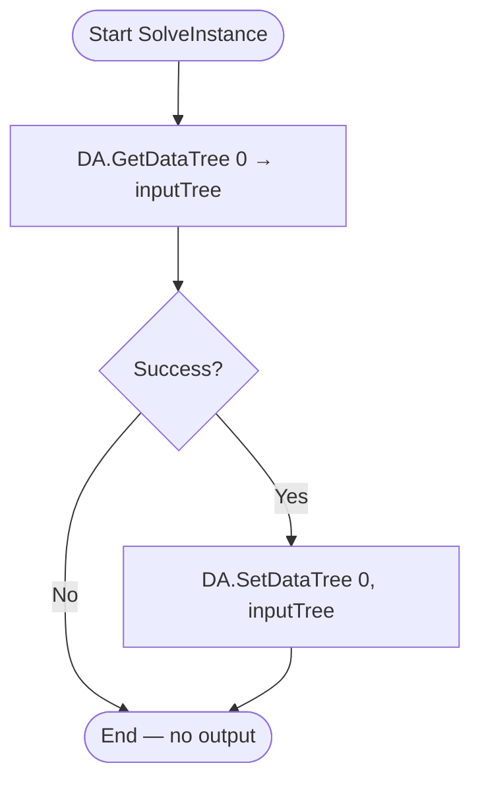

# Relay — Grasshopper Component Documentation (English)

---

## 1. Overview

| Field | Value |
|---|---|
| **Component Name** | Relay |
| **Nickname** | Relay |
| **Description** | Relay data without modification |
| **Category** | Mäkeläinen automation |
| **Subcategory** | Others |
| **Class** | `RelayComponent : GH_Component` |
| **Namespace** | `YourNamespace` |
| **GUID** | `A3C1354E-B952-47BF-A74E-6DF05A74FCA0` |
| **Exposure** | `GH_Exposure.primary` |

---

## 2. Purpose

A pure pass-through component — any DataTree passed in is emitted unchanged. Useful for:
- Organizing complex Grasshopper canvases by acting as a junction/relay point
- Grouping/labeling wires without transforming data
- Debugging: insert between components to observe intermediate data

---

## 3. Inputs & Outputs

### Inputs

| Index | Name | Nickname | Type | Access | Description |
|---|---|---|---|---|---|
| 0 | Input | Input | Generic | Tree | Any data tree to relay |

### Outputs

| Index | Name | Nickname | Type | Access | Description |
|---|---|---|---|---|---|
| 0 | Output | Output | Generic | Tree | Identical copy of input tree |

---

## 4. Flowchart



---

## 5. Classes & Methods

### 5.1 Class: `RelayComponent`

```
RelayComponent
├── Constructor
│   └── RelayComponent()  — sets Name="Relay", Nickname="Relay"
│
├── Properties
│   ├── ComponentGuid     — A3C1354E-B952-47BF-A74E-6DF05A74FCA0
│   ├── Icon              — Resources.Transformation
│   └── Exposure          — GH_Exposure.primary
│
└── Override Methods
    ├── RegisterInputParams()   — AddGenericParameter "Input" (tree)
    ├── RegisterOutputParams()  — AddGenericParameter "Output" (tree)
    └── SolveInstance()         — GetDataTree → SetDataTree
```

---

### 5.2 Method: `SolveInstance(IGH_DataAccess DA)`

```csharp
protected override void SolveInstance(IGH_DataAccess DA)
{
    GH_Structure<IGH_Goo> inputTree;
    if (!DA.GetDataTree(0, out inputTree)) return;
    DA.SetDataTree(0, inputTree);
}
```

The entire logic is two lines. No transformation, no validation, no errors possible beyond a missing input.

---

## 6. Core Logic

The component is completely transparent:
- `IGH_Goo` is Grasshopper's base interface for all data types
- `GH_Structure<IGH_Goo>` holds any mix of types in a DataTree
- The same reference is passed directly to the output

---

## 7. Error & Warning Handling

| Condition | Type | Message |
|---|---|---|
| Input tree missing/disconnected | Silent return | (no message) |

---

## 8. Template: How to Build a Similar Component

```csharp
public class MyRelay : GH_Component
{
    public MyRelay() : base("MyRelay", "MR", "Pass through", "Category", "Sub") { }

    protected override void RegisterInputParams(GH_InputParamManager pManager)
    {
        pManager.AddGenericParameter("Input", "I", "Any data", GH_ParamAccess.tree);
    }

    protected override void RegisterOutputParams(GH_OutputParamManager pManager)
    {
        pManager.AddGenericParameter("Output", "O", "Same data", GH_ParamAccess.tree);
    }

    protected override void SolveInstance(IGH_DataAccess DA)
    {
        GH_Structure<IGH_Goo> inputTree;
        if (!DA.GetDataTree(0, out inputTree)) return;
        DA.SetDataTree(0, inputTree);
    }

    public override Guid ComponentGuid => new Guid("YOUR-NEW-GUID-HERE");
}
```
