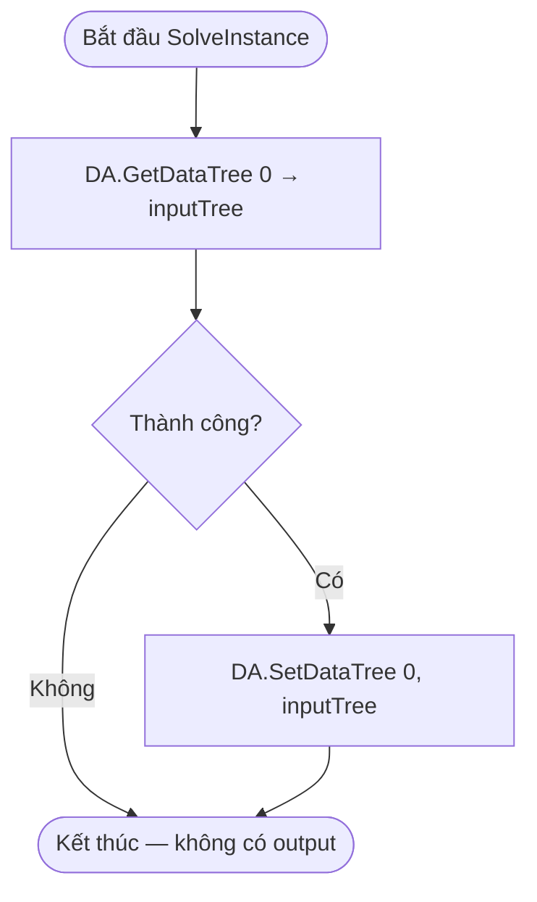

# Relay — Tài liệu Grasshopper Component (Tiếng Việt)

---

## 1. Tổng quan

| Trường | Giá trị |
|---|---|
| **Tên Component** | Relay |
| **Nickname** | Relay |
| **Mô tả** | Relay data without modification |
| **Danh mục** | Mäkeläinen automation |
| **Danh mục con** | Others |
| **Class** | `RelayComponent : GH_Component` |
| **Namespace** | `YourNamespace` |
| **GUID** | `A3C1354E-B952-47BF-A74E-6DF05A74FCA0` |
| **Exposure** | `GH_Exposure.primary` |

---

## 2. Mục đích

Đây là component truyền dữ liệu thuần túy — bất kỳ DataTree nào đưa vào đều được xuất ra không thay đổi. Hữu ích cho:
- Tổ chức canvas Grasshopper phức tạp bằng cách tạo điểm kết nối/relay
- Nhóm/đặt nhãn cho các wire mà không biến đổi dữ liệu
- Debug: chèn giữa các component để quan sát dữ liệu trung gian

---

## 3. Đầu vào & Đầu ra

### Đầu vào (Inputs)

| Chỉ số | Tên | Nickname | Kiểu | Access | Mô tả |
|---|---|---|---|---|---|
| 0 | Input | Input | Generic | Tree | Bất kỳ DataTree nào cần relay |

### Đầu ra (Outputs)

| Chỉ số | Tên | Nickname | Kiểu | Access | Mô tả |
|---|---|---|---|---|---|
| 0 | Output | Output | Generic | Tree | Bản sao y hệt của input tree |

---

## 4. Sơ đồ luồng (Flowchart)



---

## 5. Logic Chính

```csharp
protected override void SolveInstance(IGH_DataAccess DA)
{
    GH_Structure<IGH_Goo> inputTree;
    if (!DA.GetDataTree(0, out inputTree)) return;
    DA.SetDataTree(0, inputTree);
}
```

Toàn bộ logic chỉ là hai dòng. Không có biến đổi, không validate, không lỗi nào có thể xảy ra ngoài việc thiếu input.

- `IGH_Goo` là interface cơ sở của Grasshopper cho mọi kiểu dữ liệu
- `GH_Structure<IGH_Goo>` chứa mọi kiểu trong một DataTree
- Cùng một tham chiếu được truyền thẳng sang output

---

## 6. Xử lý Lỗi & Cảnh báo

| Điều kiện | Loại | Thông báo |
|---|---|---|
| Input tree thiếu/không kết nối | Trả về im lặng | (không có thông báo) |

---

## 7. Lưu ý

Component này khác với PassThroughGeometry:
- **Relay**: Dùng `GH_Structure<IGH_Goo>` — giữ nguyên cả cấu trúc DataTree
- **PassThroughGeometry**: Truy cập `VolatileData.AllData(true)` — flatten thành list, unwrap GH wrappers
