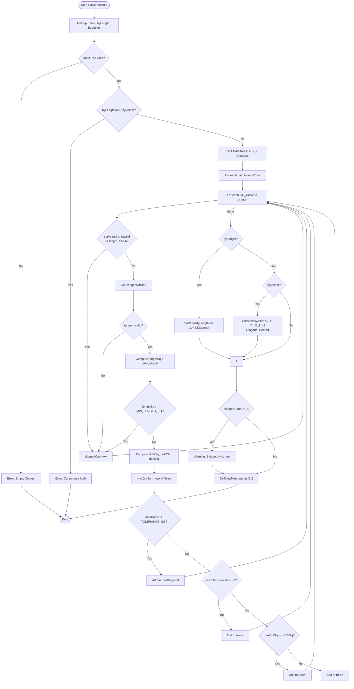

# SortCurvesByXYZ — Grasshopper Component Documentation (English)

> **Template Note:** This document is a reusable reference. To build a similar component, follow the same class structure, replace constants/axis logic, and adjust inputs/outputs accordingly.

---

## 1. Overview

| Field | Value |
|---|---|
| **Component Name** | Sort Curves by XYZ |
| **Nickname** | SortXYZ |
| **Description** | Sort and classify curves by X, Y, Z axis or Diagonal |
| **Category** | Mäkeläinen automation |
| **Subcategory** | Curves |
| **Class** | `SortCurvesByXYZ : GH_Component` |
| **Namespace** | `SortedLineByAxis` |
| **GUID** | `F090FF1A-F5C5-4FB8-8BFB-7C94C9910A25` |
| **Exposure** | `GH_Exposure.primary` |

---

## 2. Constants

```csharp
private const double TOLERANCE_SQ = 0.998001;  // 0.999² — alignment threshold
private const double MIN_LENGTH_SQ = 1e-12;    // minimum squared tangent length
```

| Constant | Value | Purpose |
|---|---|---|
| `TOLERANCE_SQ` | 0.998001 (= 0.999²) | A curve is considered axis-aligned if its squared dot product exceeds this |
| `MIN_LENGTH_SQ` | 1e-12 | Skip curves whose tangent is near-zero |

---

## 3. Inputs & Outputs

### Inputs

| Index | Name | Nickname | Type | Access | Default | Description |
|---|---|---|---|---|---|---|
| 0 | Curves | C | Curve | Tree | — | Input curves (DataTree) |
| 1 | By Length | BL | Boolean | Item | `false` | Sort each branch by curve length ascending |
| 2 | By Vector | BV | Boolean | Item | `false` | Sort each branch by spatial position |

> **Constraint:** `BL` and `BV` cannot both be `true` simultaneously.

### Outputs

| Index | Name | Nickname | Type | Access | Description |
|---|---|---|---|---|---|
| 0 | Curves_X | X | Curve | Tree | Curves parallel to X axis |
| 1 | Curves_Y | Y | Curve | Tree | Curves parallel to Y axis |
| 2 | Curves_Z | Z | Curve | Tree | Curves parallel to Z axis |
| 3 | Diagonal | Dg | Curve | Tree | Diagonal (no dominant axis) |

---

## 4. Flowchart



---

## 5. Classes & Methods

### 5.1 Class: `SortCurvesByXYZ`

Inherits `GH_Component` (Grasshopper base class for all components).

```
SortCurvesByXYZ
├── Constants
│   ├── TOLERANCE_SQ = 0.998001
│   └── MIN_LENGTH_SQ = 1e-12
│
├── Constructor
│   └── SortCurvesByXYZ()           — sets Name, Nickname, Description, Category, Subcategory
│
├── Properties
│   ├── Exposure                     — GH_Exposure.primary
│   ├── Icon                         — returns Resources.sortedline bitmap
│   └── ComponentGuid                — returns fixed GUID
│
├── Override Methods (GH_Component)
│   ├── RegisterInputParams()        — defines 3 input params
│   ├── RegisterOutputParams()       — defines 4 output params
│   └── SolveInstance()             — main execution logic
│
└── Private Helper Methods
    ├── SortTreeByLength()
    └── SortTreeByAxis()
```

---

### 5.2 Method: `SolveInstance(IGH_DataAccess DA)`

**Responsibility:** Full pipeline — fetch, validate, classify, sort, output.

```
Steps:
  1. DA.GetDataTree(0, out inputTree)
  2. DA.GetData(1, ref byLength)
  3. DA.GetData(2, ref byVector)
  4. Guard: byLength && byVector → Error
  5. Init: treeX, treeY, treeZ, treeDiagonal, skippedCount
  6. Classification loop (see §6 Logic)
  7. Conditional sort
  8. Warning if skippedCount > 0
  9. DA.SetDataTree(0..3, ...)
```

---

### 5.3 Method: `SortTreeByLength(DataTree<Curve> tree)`

**Signature:** `private DataTree<Curve> SortTreeByLength(DataTree<Curve> tree)`

**Logic:**
- For each path in tree:
  - `curves.OrderBy(c => c.GetLength())` → ascending
- Returns a new sorted DataTree preserving paths.

```csharp
var sortedCurves = curves.OrderBy(curve => curve.GetLength()).ToList();
```

---

### 5.4 Method: `SortTreeByAxis(DataTree<Curve> tree, char axis)`

**Signature:** `private DataTree<Curve> SortTreeByAxis(DataTree<Curve> tree, char axis)`

**Logic:**
- For each branch, sort curves by `Math.Min(start.{axis}, end.{axis})`.
- Uses the minimum endpoint coordinate to ensure direction-independent ordering.

| `axis` | Sort Key |
|---|---|
| `'X'` | `Math.Min(start.X, end.X)` |
| `'Y'` | `Math.Min(start.Y, end.Y)` |
| `'Z'` | `Math.Min(start.Z, end.Z)` |

**Caller mappings in SolveInstance:**

| Tree | Sorted by axis |
|---|---|
| treeX (→ X direction) | `'Y'` (perpendicular position) |
| treeY (→ Y direction) | `'X'` (perpendicular position) |
| treeZ (→ Z direction) | `'Z'` (elevation) |
| treeDiagonal | cleared (not sorted) |

---

## 6. Core Classification Logic

```
Given: curve with TangentAtStart = (dx, dy, dz)

lengthSq = dx² + dy² + dz²

dotXSq = dx² / lengthSq    // squared cosine with X axis
dotYSq = dy² / lengthSq    // squared cosine with Y axis
dotZSq = dz² / lengthSq    // squared cosine with Z axis

maxDotSq = max(dotXSq, dotYSq, dotZSq)

if maxDotSq < 0.998001  → Diagonal
elif maxDotSq == dotXSq → X
elif maxDotSq == dotYSq → Y
else                    → Z
```

**Why squared dot product?**
- Avoids `Math.Sqrt()` for performance.
- `cos²θ > 0.998001` means `cos θ > 0.999`, i.e., angle < ~2.56°.
- Handles both +X and -X (negative direction) with one check since `(-dx)²= dx²`.

---

## 7. Example Walkthrough

### Input

- 5 curves in a flat grid, DataTree path {0}
- BL = false, BV = true

### Curve Tangents

| Curve | TangentAtStart | dx | dy | dz |
|---|---|---|---|---|
| A | (1, 0, 0) | 1 | 0 | 0 |
| B | (0, 1, 0) | 0 | 1 | 0 |
| C | (0.707, 0.707, 0) | 0.707 | 0.707 | 0 |
| D | (-1, 0, 0) | -1 | 0 | 0 |
| E | (0, 0, 1) | 0 | 0 | 1 |

### Classification

| Curve | dotXSq | dotYSq | dotZSq | maxDotSq | Result |
|---|---|---|---|---|---|
| A | 1.0 | 0.0 | 0.0 | 1.0 ≥ 0.998 | **X** |
| B | 0.0 | 1.0 | 0.0 | 1.0 ≥ 0.998 | **Y** |
| C | 0.5 | 0.5 | 0.0 | 0.5 < 0.998 | **Diagonal** |
| D | 1.0 | 0.0 | 0.0 | 1.0 ≥ 0.998 | **X** |
| E | 0.0 | 0.0 | 1.0 | 1.0 ≥ 0.998 | **Z** |

### After Sort by Vector (BV = true)

- treeX = {A, D} sorted by their Y coordinate (min of start/end Y)
- treeY = {B} sorted by X coordinate
- treeZ = {E} sorted by Z coordinate
- treeDiagonal = {} (cleared)

---

## 8. Error & Warning Handling

| Condition | Type | Message |
|---|---|---|
| inputTree missing | Error | "Empty Curves" |
| BL && BV both true | Error | "Invalid Input: Cannot use By Length and By Vector at the same time" |
| Null/invalid curve, short curve, bad tangent | Warning | "Skipped N curve(s)" |

---

## 9. Template: How to Build a Similar Component

1. **Create class** inheriting `GH_Component`
2. **Define constants** for tolerance thresholds
3. **Constructor** → call `base(Name, Nickname, Description, Category, Subcategory)`
4. **`RegisterInputParams`** → define each input with type, access mode, default
5. **`RegisterOutputParams`** → define each output
6. **`SolveInstance`:**
   - Step 1: Get all inputs via `DA.GetData` / `DA.GetDataTree`
   - Step 2: Validate mutually exclusive options
   - Step 3: Init output containers
   - Step 4: Loop over data, classify into containers
   - Step 5: Apply optional transformations (sort, filter)
   - Step 6: Warnings for skipped items
   - Step 7: `DA.SetDataTree` / `DA.SetData` for each output
7. **Helper methods** for reusable operations (sort, transform)
8. **Override `Icon`** and **`ComponentGuid`** (always use a new GUID)

```csharp
// Minimal skeleton
public class MyComponent : GH_Component
{
    private const double MY_TOLERANCE = 0.998001;

    public MyComponent() : base("Name", "Nick", "Desc", "Category", "Sub") { }

    public override GH_Exposure Exposure => GH_Exposure.primary;

    protected override void RegisterInputParams(GH_InputParamManager pManager) { ... }
    protected override void RegisterOutputParams(GH_OutputParamManager pManager) { ... }

    protected override void SolveInstance(IGH_DataAccess DA)
    {
        // 1. Get inputs
        // 2. Validate
        // 3. Init output trees
        // 4. Classify / process
        // 5. Sort / transform (optional)
        // 6. Warnings
        // 7. Set outputs
    }

    protected override System.Drawing.Bitmap Icon => Resources.myicon;
    public override Guid ComponentGuid => new Guid("YOUR-NEW-GUID-HERE");
}
```
