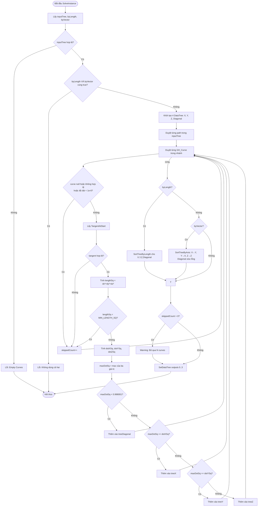

# SortCurvesByXYZ — Tài liệu Grasshopper Component (Tiếng Việt)

> **Ghi chú Template:** Tài liệu này dùng làm mẫu tái sử dụng. Để xây dựng component tương tự, hãy theo cùng cấu trúc class, thay thế hằng số/logic trục, và điều chỉnh inputs/outputs phù hợp.

---

## 1. Tổng quan

| Trường | Giá trị |
|---|---|
| **Tên Component** | Sort Curves by XYZ |
| **Nickname** | SortXYZ |
| **Mô tả** | Phân loại và sắp xếp curves theo trục X, Y, Z hoặc Diagonal |
| **Danh mục** | Mäkeläinen automation |
| **Danh mục con** | Curves |
| **Class** | `SortCurvesByXYZ : GH_Component` |
| **Namespace** | `SortedLineByAxis` |
| **GUID** | `F090FF1A-F5C5-4FB8-8BFB-7C94C9910A25` |
| **Exposure** | `GH_Exposure.primary` |

---

## 2. Hằng số (Constants)

```csharp
private const double TOLERANCE_SQ = 0.998001;  // 0.999² — ngưỡng song song trục
private const double MIN_LENGTH_SQ = 1e-12;    // độ dài bình phương tối thiểu của tangent
```

| Hằng số | Giá trị | Mục đích |
|---|---|---|
| `TOLERANCE_SQ` | 0.998001 (= 0.999²) | Curve được coi là song song trục nếu squared dot product vượt ngưỡng này |
| `MIN_LENGTH_SQ` | 1e-12 | Bỏ qua các curve có tangent gần bằng 0 |

---

## 3. Đầu vào & Đầu ra

### Đầu vào (Inputs)

| Chỉ số | Tên | Nickname | Kiểu | Access | Mặc định | Mô tả |
|---|---|---|---|---|---|---|
| 0 | Curves | C | Curve | Tree | — | Các curve đầu vào (DataTree) |
| 1 | By Length | BL | Boolean | Item | `false` | Sắp xếp từng nhánh theo độ dài curve tăng dần |
| 2 | By Vector | BV | Boolean | Item | `false` | Sắp xếp từng nhánh theo vị trí không gian |

> **Ràng buộc:** `BL` và `BV` không được đồng thời là `true`.

### Đầu ra (Outputs)

| Chỉ số | Tên | Nickname | Kiểu | Access | Mô tả |
|---|---|---|---|---|---|
| 0 | Curves_X | X | Curve | Tree | Curves song song trục X |
| 1 | Curves_Y | Y | Curve | Tree | Curves song song trục Y |
| 2 | Curves_Z | Z | Curve | Tree | Curves song song trục Z |
| 3 | Diagonal | Dg | Curve | Tree | Curves chéo (không có trục ưu thế) |

---

## 4. Sơ đồ luồng (Flowchart)



---

## 5. Classes & Methods

### 5.1 Class: `SortCurvesByXYZ`

Kế thừa `GH_Component` — class cơ sở của Grasshopper cho mọi component.

```
SortCurvesByXYZ
├── Hằng số
│   ├── TOLERANCE_SQ = 0.998001
│   └── MIN_LENGTH_SQ = 1e-12
│
├── Constructor
│   └── SortCurvesByXYZ()           — thiết lập Name, Nickname, Description, Category, Subcategory
│
├── Properties
│   ├── Exposure                     — GH_Exposure.primary
│   ├── Icon                         — trả về bitmap Resources.sortedline
│   └── ComponentGuid                — trả về GUID cố định
│
├── Override Methods (GH_Component)
│   ├── RegisterInputParams()        — khai báo 3 tham số đầu vào
│   ├── RegisterOutputParams()       — khai báo 4 tham số đầu ra
│   └── SolveInstance()             — logic thực thi chính
│
└── Helper Methods (Private)
    ├── SortTreeByLength()
    └── SortTreeByAxis()
```

---

### 5.2 Method: `SolveInstance(IGH_DataAccess DA)`

**Nhiệm vụ:** Toàn bộ pipeline — lấy dữ liệu, kiểm tra, phân loại, sắp xếp, xuất output.

```
Các bước:
  1. DA.GetDataTree(0, out inputTree)
  2. DA.GetData(1, ref byLength)
  3. DA.GetData(2, ref byVector)
  4. Guard: byLength && byVector → Error
  5. Khởi tạo: treeX, treeY, treeZ, treeDiagonal, skippedCount
  6. Vòng lặp phân loại (xem §6 Logic)
  7. Sắp xếp có điều kiện
  8. Cảnh báo nếu skippedCount > 0
  9. DA.SetDataTree(0..3, ...)
```

---

### 5.3 Method: `SortTreeByLength(DataTree<Curve> tree)`

**Chữ ký:** `private DataTree<Curve> SortTreeByLength(DataTree<Curve> tree)`

**Logic:**
- Duyệt từng path trong tree:
  - `curves.OrderBy(c => c.GetLength())` → tăng dần
- Trả về DataTree mới đã sắp xếp, giữ nguyên paths.

```csharp
var sortedCurves = curves.OrderBy(curve => curve.GetLength()).ToList();
```

---

### 5.4 Method: `SortTreeByAxis(DataTree<Curve> tree, char axis)`

**Chữ ký:** `private DataTree<Curve> SortTreeByAxis(DataTree<Curve> tree, char axis)`

**Logic:**
- Với mỗi nhánh, sắp xếp curves theo `Math.Min(start.{axis}, end.{axis})`.
- Dùng giá trị tọa độ nhỏ hơn giữa hai đầu curve để đảm bảo độc lập hướng.

| `axis` | Khóa sắp xếp |
|---|---|
| `'X'` | `Math.Min(start.X, end.X)` |
| `'Y'` | `Math.Min(start.Y, end.Y)` |
| `'Z'` | `Math.Min(start.Z, end.Z)` |

**Ánh xạ trong SolveInstance khi byVector = true:**

| Tree | Sắp xếp theo trục |
|---|---|
| treeX (curves hướng X) | `'Y'` (vị trí vuông góc) |
| treeY (curves hướng Y) | `'X'` (vị trí vuông góc) |
| treeZ (curves hướng Z) | `'Z'` (cao độ) |
| treeDiagonal | xóa rỗng (không sắp xếp) |

---

## 6. Logic Phân loại Cốt lõi

```
Cho trước: curve với TangentAtStart = (dx, dy, dz)

lengthSq = dx² + dy² + dz²

dotXSq = dx² / lengthSq    // cos² góc với trục X
dotYSq = dy² / lengthSq    // cos² góc với trục Y
dotZSq = dz² / lengthSq    // cos² góc với trục Z

maxDotSq = max(dotXSq, dotYSq, dotZSq)

if maxDotSq < 0.998001  → Diagonal
elif maxDotSq == dotXSq → X
elif maxDotSq == dotYSq → Y
else                    → Z
```

**Tại sao dùng bình phương dot product?**
- Tránh `Math.Sqrt()` để tăng hiệu suất.
- `cos²θ > 0.998001` nghĩa là `cos θ > 0.999`, tức góc < ~2.56°.
- Xử lý cả +X lẫn -X (hướng âm) chỉ với một phép kiểm tra vì `(-dx)² = dx²`.

---

## 7. Ví dụ Thực tế

### Đầu vào

- 5 curves trong lưới phẳng, DataTree path {0}
- BL = false, BV = true

### Tangent của từng Curve

| Curve | TangentAtStart | dx | dy | dz |
|---|---|---|---|---|
| A | (1, 0, 0) | 1 | 0 | 0 |
| B | (0, 1, 0) | 0 | 1 | 0 |
| C | (0.707, 0.707, 0) | 0.707 | 0.707 | 0 |
| D | (-1, 0, 0) | -1 | 0 | 0 |
| E | (0, 0, 1) | 0 | 0 | 1 |

### Kết quả Phân loại

| Curve | dotXSq | dotYSq | dotZSq | maxDotSq | Kết quả |
|---|---|---|---|---|---|
| A | 1.0 | 0.0 | 0.0 | 1.0 ≥ 0.998 | **X** |
| B | 0.0 | 1.0 | 0.0 | 1.0 ≥ 0.998 | **Y** |
| C | 0.5 | 0.5 | 0.0 | 0.5 < 0.998 | **Diagonal** |
| D | 1.0 | 0.0 | 0.0 | 1.0 ≥ 0.998 | **X** |
| E | 0.0 | 0.0 | 1.0 | 1.0 ≥ 0.998 | **Z** |

### Sau khi Sort by Vector (BV = true)

- treeX = {A, D} sắp xếp theo tọa độ Y nhỏ hơn giữa hai đầu
- treeY = {B} sắp xếp theo tọa độ X
- treeZ = {E} sắp xếp theo tọa độ Z
- treeDiagonal = {} (xóa rỗng)

---

## 8. Xử lý Lỗi & Cảnh báo

| Điều kiện | Loại | Thông báo |
|---|---|---|
| inputTree thiếu | Error | "Empty Curves" |
| BL && BV cùng true | Error | "Invalid Input: Cannot use By Length and By Vector at the same time" |
| Curve null/không hợp lệ/ngắn/tangent xấu | Warning | "Skipped N curve(s)" |

---

## 9. Template: Cách Xây dựng Component Tương tự

1. **Tạo class** kế thừa `GH_Component`
2. **Khai báo hằng số** cho ngưỡng tolerance
3. **Constructor** → gọi `base(Name, Nickname, Description, Category, Subcategory)`
4. **`RegisterInputParams`** → khai báo từng input với kiểu, access mode, giá trị mặc định
5. **`RegisterOutputParams`** → khai báo từng output
6. **`SolveInstance`:**
   - Bước 1: Lấy tất cả inputs qua `DA.GetData` / `DA.GetDataTree`
   - Bước 2: Kiểm tra các tùy chọn loại trừ lẫn nhau
   - Bước 3: Khởi tạo các container output
   - Bước 4: Vòng lặp qua dữ liệu, phân loại vào containers
   - Bước 5: Áp dụng biến đổi tùy chọn (sort, filter)
   - Bước 6: Cảnh báo cho các item bị bỏ qua
   - Bước 7: `DA.SetDataTree` / `DA.SetData` cho từng output
7. **Helper methods** cho các thao tác tái sử dụng (sort, transform)
8. **Override `Icon`** và **`ComponentGuid`** (luôn dùng GUID mới)

```csharp
// Skeleton tối giản
public class MyComponent : GH_Component
{
    private const double MY_TOLERANCE = 0.998001;

    public MyComponent() : base("Tên", "Nick", "Mô tả", "Danh mục", "Danh mục con") { }

    public override GH_Exposure Exposure => GH_Exposure.primary;

    protected override void RegisterInputParams(GH_InputParamManager pManager) { ... }
    protected override void RegisterOutputParams(GH_OutputParamManager pManager) { ... }

    protected override void SolveInstance(IGH_DataAccess DA)
    {
        // 1. Lấy inputs
        // 2. Kiểm tra hợp lệ
        // 3. Khởi tạo output trees
        // 4. Phân loại / xử lý
        // 5. Sắp xếp / biến đổi (tùy chọn)
        // 6. Cảnh báo
        // 7. Set outputs
    }

    protected override System.Drawing.Bitmap Icon => Resources.myicon;
    public override Guid ComponentGuid => new Guid("GUID-MỚI-CỦA-BẠN");
}
```

---

## 10. Lưu ý Quan trọng

- **GUID phải là duy nhất** cho mỗi component. Dùng `Guid.NewGuid()` hoặc công cụ trực tuyến để tạo.
- **Giữ nguyên path** của DataTree input khi tạo output (truyền `path` vào `tree.Add(item, path)`).
- **Không sắp xếp Diagonal** khi dùng By Vector — xóa rỗng thay vì sắp xếp.
- **Chế độ bình phương** (squared dot product) là kỹ thuật tối ưu phổ biến, tránh sqrt không cần thiết.
