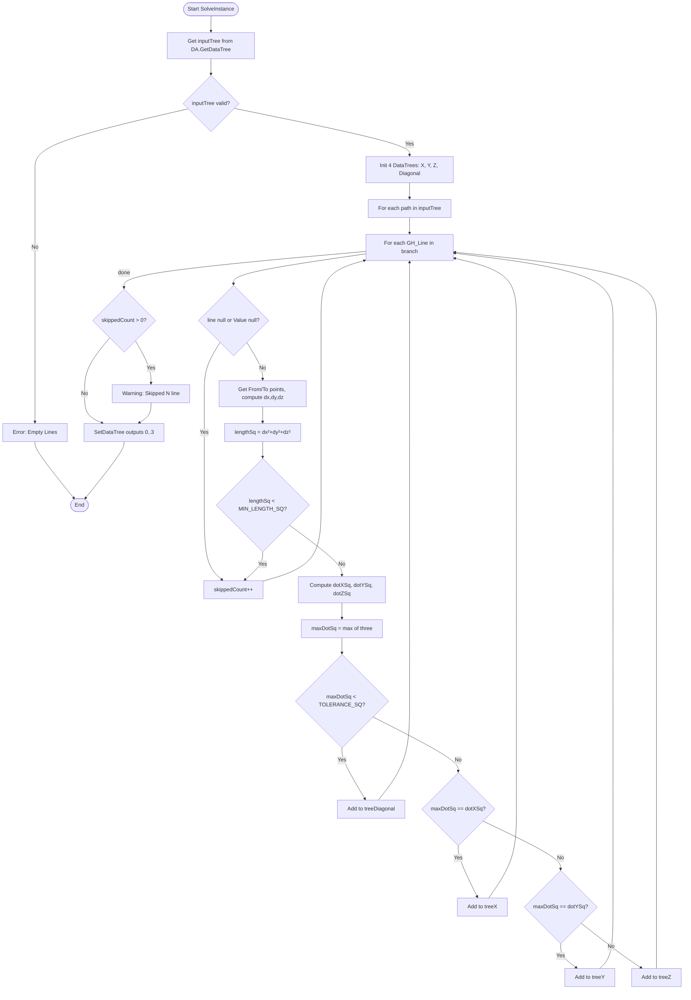

# SortLineByAxis — Grasshopper Component Documentation (English)

> **Template Note:** This document is a reusable reference. To build a similar component, follow the same class structure, replace constants/axis logic, and adjust inputs/outputs accordingly.

---

## 1. Overview

| Field | Value |
|---|---|
| **Component Name** | SortLineByAxis |
| **Nickname** | SortLineByAxis |
| **Description** | Sort Line by Axis |
| **Category** | Mäkeläinen automation |
| **Subcategory** | Curves |
| **Class** | `SortLine : GH_Component` |
| **Namespace** | `SortedLineByAxis` |
| **GUID** | `6CB18079-334C-4532-882E-91BFE5A903FE` |
| **Exposure** | `GH_Exposure.primary` |

---

## 2. Constants

```csharp
private const double TOLERANCE_SQ = 0.998001;  // 0.999² — alignment threshold
private const double MIN_LENGTH_SQ = 1e-12;    // minimum squared direction length
```

| Constant | Value | Purpose |
|---|---|---|
| `TOLERANCE_SQ` | 0.998001 (= 0.999²) | A line is axis-aligned if its squared dot product exceeds this |
| `MIN_LENGTH_SQ` | 1e-12 | Skip lines whose direction vector is near-zero |

---

## 3. Inputs & Outputs

### Inputs

| Index | Name | Nickname | Type | Access | Default | Description |
|---|---|---|---|---|---|---|
| 0 | Lines | Ln | Line | Tree | — | Input lines (DataTree) |

### Outputs

| Index | Name | Nickname | Type | Access | Description |
|---|---|---|---|---|---|
| 0 | toFX | X | Line | Tree | Lines parallel to X axis |
| 1 | toFY | Y | Line | Tree | Lines parallel to Y axis |
| 2 | toFZ | Z | Line | Tree | Lines parallel to Z axis |
| 3 | Diagonal | Dg | Line | Tree | Diagonal lines (no dominant axis) |

---

## 4. Flowchart



---

## 5. Classes & Methods

### 5.1 Class: `SortLine`

Inherits `GH_Component`.

```
SortLine
├── Constants
│   ├── TOLERANCE_SQ = 0.998001
│   └── MIN_LENGTH_SQ = 1e-12
│
├── Constructor
│   └── SortLine()           — sets Name, Nickname, Description, Category, Subcategory
│
├── Properties
│   ├── Exposure             — GH_Exposure.primary
│   ├── Icon                 — returns Resources.sortedline bitmap
│   └── ComponentGuid        — returns fixed GUID
│
└── Override Methods
    ├── RegisterInputParams() — defines 1 input (Lines, tree)
    ├── RegisterOutputParams() — defines 4 outputs (X, Y, Z, Diagonal)
    └── SolveInstance()      — main execution logic
```

---

### 5.2 Method: `SolveInstance(IGH_DataAccess DA)`

**Responsibility:** Full pipeline — fetch, classify, output.

```
Steps:
  1. DA.GetDataTree(0, out inputTree)
  2. Init: treeX, treeY, treeZ, treeDiagonal, skippedCount
  3. For each path → for each GH_Line:
     a. Null check
     b. Compute dx = To.X - From.X, dy = ..., dz = ...
     c. lengthSq = dx²+dy²+dz²
     d. Skip if lengthSq < MIN_LENGTH_SQ
     e. dotXSq = dx²/lengthSq, dotYSq = dy²/lengthSq, dotZSq = dz²/lengthSq
     f. maxDotSq = max(dotXSq, dotYSq, dotZSq)
     g. Classify: Diagonal / X / Y / Z
  4. Warning if skippedCount > 0
  5. DA.SetDataTree(0..3, ...)
```

---

## 6. Core Classification Logic

```
Given: line with direction (dx, dy, dz) = To - From

lengthSq = dx² + dy² + dz²

dotXSq = dx² / lengthSq    // squared cosine with X axis
dotYSq = dy² / lengthSq    // squared cosine with Y axis
dotZSq = dz² / lengthSq    // squared cosine with Z axis

maxDotSq = max(dotXSq, dotYSq, dotZSq)

if maxDotSq < 0.998001  → Diagonal
elif maxDotSq == dotXSq → X
elif maxDotSq == dotYSq → Y
else                    → Z
```

**Key differences from SortCurvesByXYZ:**
- Input type is `Line` (not `Curve`) — direction computed as `To - From` directly
- No optional sort modes (BL/BV) — pure classification only
- Uses `GH_Line` wrapper instead of `GH_Curve`

**Why squared dot product?**
- Avoids `Math.Sqrt()` for performance.
- `cos²θ > 0.998001` means angle < ~2.56°.
- Handles both +X and -X with one check since `(-dx)² = dx²`.

---

## 7. Example Walkthrough

### Input

- 4 lines in a grid, DataTree path {0}

### Line Directions

| Line | From | To | dx | dy | dz |
|---|---|---|---|---|---|
| A | (0,0,0) | (5,0,0) | 5 | 0 | 0 |
| B | (0,0,0) | (0,3,0) | 0 | 3 | 0 |
| C | (0,0,0) | (0,0,4) | 0 | 0 | 4 |
| D | (0,0,0) | (2,2,0) | 2 | 2 | 0 |

### Classification

| Line | dotXSq | dotYSq | dotZSq | maxDotSq | Result |
|---|---|---|---|---|---|
| A | 1.0 | 0.0 | 0.0 | 1.0 ≥ 0.998 | **X** |
| B | 0.0 | 1.0 | 0.0 | 1.0 ≥ 0.998 | **Y** |
| C | 0.0 | 0.0 | 1.0 | 1.0 ≥ 0.998 | **Z** |
| D | 0.5 | 0.5 | 0.0 | 0.5 < 0.998 | **Diagonal** |

---

## 8. Error & Warning Handling

| Condition | Type | Message |
|---|---|---|
| inputTree missing | Error | "Empty Lines" |
| Null line or Value null | Warning | "Skiped N line" |
| lengthSq < MIN_LENGTH_SQ | Warning | "Skiped N line" |

---

## 9. Template: How to Build a Similar Component

Follow the same pattern as SortCurvesByXYZ but:
1. Change `AddLineParameter` instead of `AddCurveParameter`
2. Use `GH_Structure<GH_Line>` and `DataTree<Line>`
3. Compute direction as `To - From` instead of `TangentAtStart`
4. Remove sort helper methods if not needed

```csharp
// Minimal skeleton
public class MySortLine : GH_Component
{
    private const double TOLERANCE_SQ = 0.998001;
    private const double MIN_LENGTH_SQ = 1e-12;

    public MySortLine() : base("Name", "Nick", "Desc", "Category", "Sub") { }

    protected override void RegisterInputParams(GH_InputParamManager pManager)
    {
        pManager.AddLineParameter("Lines", "Ln", "...", GH_ParamAccess.tree);
    }

    protected override void RegisterOutputParams(GH_OutputParamManager pManager)
    {
        pManager.AddLineParameter("X", "X", "...", GH_ParamAccess.tree);
        // ... Y, Z, Diagonal
    }

    protected override void SolveInstance(IGH_DataAccess DA)
    {
        GH_Structure<GH_Line> inputTree;
        if (!DA.GetDataTree(0, out inputTree)) { /* Error */ return; }
        // Classification loop using squared dot product
        // DA.SetDataTree(0..3, ...)
    }

    public override Guid ComponentGuid => new Guid("YOUR-NEW-GUID-HERE");
}
```
