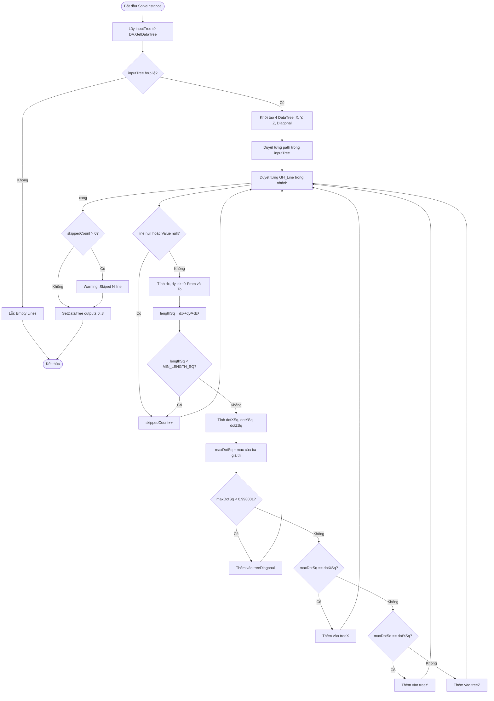

# SortLineByAxis — Tài liệu Grasshopper Component (Tiếng Việt)

> **Ghi chú Template:** Tài liệu này dùng làm mẫu tái sử dụng. Để xây dựng component tương tự, hãy theo cùng cấu trúc class, thay thế hằng số/logic trục, và điều chỉnh inputs/outputs phù hợp.

---

## 1. Tổng quan

| Trường | Giá trị |
|---|---|
| **Tên Component** | SortLineByAxis |
| **Nickname** | SortLineByAxis |
| **Mô tả** | Sort Line by Axis |
| **Danh mục** | Mäkeläinen automation |
| **Danh mục con** | Curves |
| **Class** | `SortLine : GH_Component` |
| **Namespace** | `SortedLineByAxis` |
| **GUID** | `6CB18079-334C-4532-882E-91BFE5A903FE` |
| **Exposure** | `GH_Exposure.primary` |

---

## 2. Hằng số (Constants)

```csharp
private const double TOLERANCE_SQ = 0.998001;  // 0.999² — ngưỡng song song trục
private const double MIN_LENGTH_SQ = 1e-12;    // độ dài bình phương tối thiểu của vector hướng
```

| Hằng số | Giá trị | Mục đích |
|---|---|---|
| `TOLERANCE_SQ` | 0.998001 (= 0.999²) | Line được coi là song song trục nếu squared dot product vượt ngưỡng này |
| `MIN_LENGTH_SQ` | 1e-12 | Bỏ qua các line có vector hướng gần bằng 0 |

---

## 3. Đầu vào & Đầu ra

### Đầu vào (Inputs)

| Chỉ số | Tên | Nickname | Kiểu | Access | Mặc định | Mô tả |
|---|---|---|---|---|---|---|
| 0 | Lines | Ln | Line | Tree | — | Các line đầu vào (DataTree) |

### Đầu ra (Outputs)

| Chỉ số | Tên | Nickname | Kiểu | Access | Mô tả |
|---|---|---|---|---|---|
| 0 | toFX | X | Line | Tree | Lines song song trục X |
| 1 | toFY | Y | Line | Tree | Lines song song trục Y |
| 2 | toFZ | Z | Line | Tree | Lines song song trục Z |
| 3 | Diagonal | Dg | Line | Tree | Lines chéo (không có trục ưu thế) |

---

## 4. Sơ đồ luồng (Flowchart)



---

## 5. Classes & Methods

### 5.1 Class: `SortLine`

Kế thừa `GH_Component`.

```
SortLine
├── Hằng số
│   ├── TOLERANCE_SQ = 0.998001
│   └── MIN_LENGTH_SQ = 1e-12
│
├── Constructor
│   └── SortLine()           — thiết lập Name, Nickname, Description, Category, Subcategory
│
├── Properties
│   ├── Exposure             — GH_Exposure.primary
│   ├── Icon                 — trả về Resources.sortedline
│   └── ComponentGuid        — trả về GUID cố định
│
└── Override Methods
    ├── RegisterInputParams() — khai báo 1 input (Lines, tree)
    ├── RegisterOutputParams() — khai báo 4 output (X, Y, Z, Diagonal)
    └── SolveInstance()      — logic thực thi chính
```

---

## 6. Logic Phân loại Cốt lõi

```
Cho trước: line với hướng (dx, dy, dz) = To - From

lengthSq = dx² + dy² + dz²

dotXSq = dx² / lengthSq    // cos² góc với trục X
dotYSq = dy² / lengthSq    // cos² góc với trục Y
dotZSq = dz² / lengthSq    // cos² góc với trục Z

maxDotSq = max(dotXSq, dotYSq, dotZSq)

if maxDotSq < 0.998001  → Diagonal
elif maxDotSq == dotXSq → X
elif maxDotSq == dotYSq → Y
else                    → Z
```

**Điểm khác biệt so với SortCurvesByXYZ:**
- Kiểu đầu vào là `Line` (không phải `Curve`) — hướng tính từ `To - From` trực tiếp
- Không có tùy chọn sắp xếp (BL/BV) — chỉ phân loại thuần túy
- Dùng `GH_Line` thay vì `GH_Curve`

---

## 7. Ví dụ Thực tế

### Đầu vào

- 4 lines trong lưới, DataTree path {0}

### Hướng của các Line

| Line | From | To | dx | dy | dz |
|---|---|---|---|---|---|
| A | (0,0,0) | (5,0,0) | 5 | 0 | 0 |
| B | (0,0,0) | (0,3,0) | 0 | 3 | 0 |
| C | (0,0,0) | (0,0,4) | 0 | 0 | 4 |
| D | (0,0,0) | (2,2,0) | 2 | 2 | 0 |

### Kết quả Phân loại

| Line | dotXSq | dotYSq | dotZSq | maxDotSq | Kết quả |
|---|---|---|---|---|---|
| A | 1.0 | 0.0 | 0.0 | 1.0 ≥ 0.998 | **X** |
| B | 0.0 | 1.0 | 0.0 | 1.0 ≥ 0.998 | **Y** |
| C | 0.0 | 0.0 | 1.0 | 1.0 ≥ 0.998 | **Z** |
| D | 0.5 | 0.5 | 0.0 | 0.5 < 0.998 | **Diagonal** |

---

## 8. Xử lý Lỗi & Cảnh báo

| Điều kiện | Loại | Thông báo |
|---|---|---|
| inputTree thiếu | Error | "Empty Lines" |
| Line null hoặc Value null | Warning | "Skiped N line" |
| lengthSq < MIN_LENGTH_SQ | Warning | "Skiped N line" |

---

## 9. Lưu ý Quan trọng

- **GUID phải là duy nhất** cho mỗi component.
- **Giữ nguyên path** của DataTree input khi tạo output.
- **Chế độ bình phương** là kỹ thuật tối ưu tránh sqrt không cần thiết.
- Component này đơn giản hơn SortCurvesByXYZ: không có BL/BV sort options.
