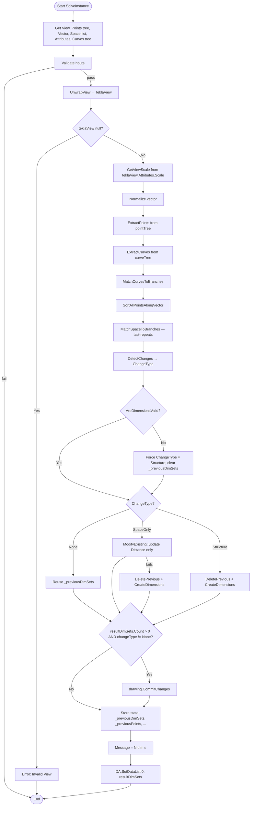

# TeklaDimension R3 — Grasshopper Component Documentation (English)

> **Reuse Template:** This document serves as a reference for building Tekla-integrated Grasshopper components. Key patterns: change detection (None/SpaceOnly/Structure), canvas selection sync, space-to-paper conversion, and tree-matching strategies.

---

## 1. Overview

| Field | Value |
|---|---|
| **Component Name** | Tekla Straight Dimension |
| **Nickname** | TDim |
| **Description** | Creates straight dimension sets in Tekla drawings with automatic scale conversion. Points are auto-sorted along vector direction. Select this component on canvas to highlight dimensions in Tekla. |
| **Category** | Mäkeläinen automation |
| **Subcategory** | Others |
| **Main Class** | `TeklaDimensionR3Component : GH_Component` |
| **Attributes Class** | `TeklaDimR3ComponentAttributes : GH_ComponentAttributes` |
| **Namespace** | `TeklaGrasshopperTools` |
| **GUID** | `D4E5F6A7-B8C9-4D2E-A1F3-072B6C8E3D5A` |
| **Exposure** | `GH_Exposure.primary` |

---

## 2. Inputs & Outputs

### Inputs

| Index | Name | Nickname | Type | Access | Default | Description |
|---|---|---|---|---|---|---|
| 0 | View | V | Generic | Item | — | Tekla View object |
| 1 | Points | P | Point | Tree | — | Points to dimension — auto-sorted along vector |
| 2 | Vector | Vec | Vector | Item | — | Direction vector (perpendicular to reference curve) |
| 3 | Space | S | Number | List | `[1.0]` | Distance from points to dimension line (model mm). Last value repeats for extra branches. |
| 4 | Attributes | Attr | Text | Item | `"standard"` | Dimension attributes name |
| 5 | Std.Curves | RC | Curve | Tree | — | Reference curves (tree or single) |

### Outputs

| Index | Name | Nickname | Type | Access | Description |
|---|---|---|---|---|---|
| 0 | Dimension Lines | Dims | Generic | List | Created `StraightDimensionSet` objects |

---

## 3. Flowchart



---

## 4. Classes & Methods

### 4.1 Class: `TeklaDimR3ComponentAttributes`

Custom attributes for **canvas selection sync** with Tekla.

```
TeklaDimR3ComponentAttributes : GH_ComponentAttributes
└── Selected (override property)
    ├── get → base.Selected
    └── set:
        If value changed (deselected → selected or vice versa):
          Cast Owner to TeklaDimensionR3Component
          if (value == true)  → call HighlightDimensionsInTekla()
          if (value == false) → call UnhighlightDimensionsInTekla()
```

---

### 4.2 Class: `TeklaDimensionR3Component`

```
TeklaDimensionR3Component
│
├── Private State Fields
│   ├── _previousDimSets       : List<StraightDimensionSet>
│   ├── _previousSpaceList     : List<double>
│   ├── _previousViewScale     : double
│   ├── _previousAttributes    : string
│   ├── _previousVector        : Vector3d
│   ├── _previousPoints        : List<List<Point3d>>
│   ├── _previousCurves        : List<Curve>
│   └── _drawingHandler        : DrawingHandler
│
├── CreateAttributes()          — install TeklaDimR3ComponentAttributes
├── CreatedDimensionSets        — public readonly property exposing _previousDimSets
│
├── Tekla Selection Sync
│   ├── HighlightDimensionsInTekla()   — selector.SelectObjects on _previousDimSets
│   └── UnhighlightDimensionsInTekla() — selector.UnselectObjects on _previousDimSets
│
├── SolveInstance()             — main pipeline
│
├── Point Sorting
│   ├── SortPointsAlongVector()         — sort by dominant axis of vector
│   └── SortAllPointsAlongVector()      — apply per branch
│
├── Input Extraction & Matching
│   ├── ExtractPoints()                 — GH_Structure<GH_Point> → List<List<Point3d>>
│   ├── ExtractCurves()                 — GH_Structure<GH_Curve> → List<Curve>
│   ├── MatchCurvesToBranches()         — 1-to-many, 1:1, or truncate
│   └── MatchSpaceToBranches()          — last-item-repeats pattern
│
├── Change Detection
│   ├── DetectChanges()                 — returns None / SpaceOnly / Structure
│   ├── VectorsEqual()
│   ├── PointsEqual()
│   ├── CurvesEqual()
│   └── SpaceListEqual()
│
├── Distance Calculation
│   └── CalcDistanceFromProjection()    — perpDist + 1000*(space/viewScale)
│
├── Modify Existing
│   └── ModifyExisting()                — update Distance only on existing dimSets
│
├── Validation
│   ├── ValidateInputs()
│   ├── IsValidView()                   — unwrap GH_ObjectWrapper + reflection
│   ├── UnwrapView()                    — same unwrap → cast to Tekla.View
│   ├── GetViewScale()                  — teklaView.Attributes.Scale
│   └── IsVectorPerpendicular()         — dot product check vs curve direction
│
├── Delete Previous
│   └── DeletePrevious()                — dimSet.Delete() for each in _previousDimSets
│
├── Create Dimensions
│   ├── CreateDimensions()              — main loop over branches
│   ├── CreateSingleDimension()         — builds PointList, calls handler.CreateDimensionSet
│   └── FindReferencePoint()            — ray-line intersection for closest point
│
├── Dimension Validity Check
│   └── AreDimensionsValid()            — dimSet.Select() for each stored dimSet
│
└── Enum: ChangeType
    ├── None        — no change, reuse existing
    ├── SpaceOnly   — only space/scale changed → modify distance only
    └── Structure   — anything else → delete + recreate
```

---

## 5. Key Algorithms

### 5.1 Space-to-Paper Conversion

The `Space` input is in **model millimetres**. Tekla drawing dimensions use **paper space** units. The conversion:

```csharp
double spaceNew = 1000.0 * (space / viewScale);
```

Example: space = 5 mm, viewScale = 20 (1:20) → spaceNew = 1000 × (5/20) = 250 paper units

The final distance adds the perpendicular distance from the first sorted point to the reference curve:

```csharp
double perpDist = sortedPoints[0].DistanceTo(projectedPoint);
double distance = perpDist + spaceNew;
```

---

### 5.2 Change Detection (3-level)

```
Compare current state vs stored _previous* fields:

1. If _previousDimSets empty      → Structure
2. If attributes changed          → Structure
3. If vector changed              → Structure
4. If points changed              → Structure
5. If curves changed              → Structure
6. If space or viewScale changed  → SpaceOnly
7. Otherwise                      → None
```

| Type | Action |
|---|---|
| `None` | Return `_previousDimSets` as-is |
| `SpaceOnly` | Call `ModifyExisting()` (update `Distance` property only) |
| `Structure` | `DeletePrevious()` + `CreateDimensions()` from scratch |

---

### 5.3 Auto-Sort Points Along Vector

```csharp
double absX = Math.Abs(normalizedVector.X);
double absY = Math.Abs(normalizedVector.Y);
double absZ = Math.Abs(normalizedVector.Z);

if (absX >= absY && absX >= absZ)     // X dominant
    → OrderByDescending(pt => pt.Y)  // top-to-bottom
else if (absY >= absX && absY >= absZ) // Y dominant
    → OrderBy(pt => pt.X)            // left-to-right
else                                   // Z dominant
    → OrderBy(pt => pt.Z)            // low-to-high
```

---

### 5.4 MatchSpaceToBranches (Last-Repeats Pattern)

```
branches = 4, spaceList = [10.0, 15.0]

→ branch 0 = 10.0
→ branch 1 = 15.0
→ branch 2 = 15.0  (last value repeats)
→ branch 3 = 15.0  (last value repeats)
```

---

### 5.5 MatchCurvesToBranches

```
1 curve + N branches → reuse same curve for all N
N curves = N branches → pair 1:1
otherwise → take min(N_curves, N_branches), warn about mismatch
```

---

## 6. Example Walkthrough

### Setup

- Tekla view at scale 1:20
- Points tree: 2 branches
  - {0}: [(0,0,0), (1000,0,0)]
  - {1}: [(0,500,0), (1000,500,0)]
- Vector: (0,1,0) — Y-dominant
- Space: [5.0]
- Reference curve: a horizontal line at Y=-100

### Execution

1. `GetViewScale` → 20.0
2. `ExtractPoints` → [[P00, P01], [P10, P11]]
3. `SortAllPointsAlongVector` (Y-dominant → sort by X asc):
   - Branch 0: [(0,0,0), (1000,0,0)] ✓
   - Branch 1: [(0,500,0), (1000,500,0)] ✓
4. `MatchSpaceToBranches([5.0], 2)` → [5.0, 5.0]
5. `DetectChanges` → `Structure` (first run, no previous)
6. `CreateDimensions`:
   - Branch 0: `spaceNew = 1000*(5/20) = 250`; `perpDist` ≈ 100; `distance` = 350
   - Branch 1: similar calculation
7. `drawing.CommitChanges()`
8. `Message = "2 dim(s)"`

---

## 7. Error & Warning Handling

| Condition | Type | Message |
|---|---|---|
| viewObject is null or invalid | Error | "Invalid View" |
| pointTree empty | Error | "Points tree is empty" |
| vector invalid or zero-length | Error | "Invalid vector" |
| spaceList empty | Error | "Space list is empty" |
| spaceList has non-positive values | Warning | "Space values should be positive..." |
| curveTree empty | Error | "Curves tree is empty" |
| Curve too short for perp check | Warning | "Branch N: Curve too short" |
| Vector parallel to curve | Error | "Branch N: Vector parallel to curve" |
| Vector not perfectly perpendicular | Warning | "Branch N: Vector not perfectly perpendicular (dot=X.XXX)" |
| Branch count mismatch | Warning | "Branch count mismatch: N point branches vs M curves..." |
| ModifyExisting fails | Warning | "Modify failed, recreating: ..." |
| Highlight/unhighlight fails | Warning | "Could not highlight in Tekla: ..." |
| CommitChanges fails | Warning | "Commit failed: ..." |

---

## 8. Template: Building a Similar Tekla-Integrated Component

```csharp
// 1. Custom attributes for canvas selection sync
public class MyComponentAttributes : GH_ComponentAttributes
{
    public override bool Selected
    {
        get => base.Selected;
        set
        {
            bool prev = base.Selected;
            base.Selected = value;
            if (value != prev)
            {
                var comp = Owner as MyComponent;
                if (comp != null)
                {
                    if (value) comp.HighlightInTekla();
                    else       comp.UnhighlightInTekla();
                }
            }
        }
    }
}

// 2. Main component
public class MyComponent : GH_Component
{
    private List<StraightDimensionSet> _prevDimSets = new List<StraightDimensionSet>();
    private double _prevScale = double.NaN;
    // ... other state fields

    public override void CreateAttributes()
        => m_attributes = new MyComponentAttributes(this);

    protected override void SolveInstance(IGH_DataAccess DA)
    {
        // Get inputs, validate
        // Detect changes (None / SpaceOnly / Structure)
        // Handle each case
        // CommitChanges if needed
        // Store state
    }
}

// 3. Space conversion formula
double spaceNew = 1000.0 * (space / viewScale);
double distance = perpDist + spaceNew;

// 4. MatchSpaceToBranches (last-repeats)
for (int i = 0; i < branchCount; i++)
    matched.Add(i < spaceList.Count ? spaceList[i] : spaceList[spaceList.Count - 1]);
```
