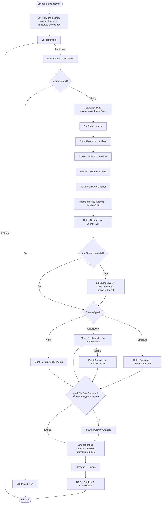

# TeklaDimension R3 — Tài liệu Grasshopper Component (Tiếng Việt)

> **Mẫu Tái sử dụng:** Tài liệu này dùng làm tham chiếu khi xây dựng các Grasshopper component tích hợp Tekla. Các pattern chính: phát hiện thay đổi (None/SpaceOnly/Structure), đồng bộ chọn trên canvas, chuyển đổi không gian model→bản vẽ, chiến lược khớp tree.

---

## 1. Tổng quan

| Trường | Giá trị |
|---|---|
| **Tên Component** | Tekla Straight Dimension |
| **Nickname** | TDim |
| **Mô tả** | Tạo dimension set dạng thẳng trong bản vẽ Tekla với chuyển đổi tỷ lệ tự động. Điểm được tự sắp xếp theo hướng vector. Chọn component trên canvas để highlight dimension trong Tekla. |
| **Danh mục** | Mäkeläinen automation |
| **Danh mục con** | Others |
| **Class Chính** | `TeklaDimensionR3Component : GH_Component` |
| **Class Attributes** | `TeklaDimR3ComponentAttributes : GH_ComponentAttributes` |
| **Namespace** | `TeklaGrasshopperTools` |
| **GUID** | `D4E5F6A7-B8C9-4D2E-A1F3-072B6C8E3D5A` |
| **Exposure** | `GH_Exposure.primary` |

---

## 2. Đầu vào & Đầu ra

### Đầu vào (Inputs)

| Chỉ số | Tên | Nickname | Kiểu | Access | Mặc định | Mô tả |
|---|---|---|---|---|---|---|
| 0 | View | V | Generic | Item | — | Đối tượng Tekla View |
| 1 | Points | P | Point | Tree | — | Điểm cần dimension — tự sắp xếp theo vector |
| 2 | Vector | Vec | Vector | Item | — | Hướng vector (vuông góc với đường tham chiếu) |
| 3 | Space | S | Number | List | `[1.0]` | Khoảng cách từ điểm đến dimension line (mm model). Giá trị cuối lặp lại cho các nhánh thừa. |
| 4 | Attributes | Attr | Text | Item | `"standard"` | Tên attributes dimension |
| 5 | Std.Curves | RC | Curve | Tree | — | Đường tham chiếu (tree hoặc đơn) |

### Đầu ra (Outputs)

| Chỉ số | Tên | Nickname | Kiểu | Access | Mô tả |
|---|---|---|---|---|---|
| 0 | Dimension Lines | Dims | Generic | List | Các đối tượng `StraightDimensionSet` đã tạo |

---

## 3. Sơ đồ luồng (Flowchart)



---

## 4. Classes & Methods

### 4.1 Class: `TeklaDimR3ComponentAttributes`

Attributes tùy chỉnh để **đồng bộ chọn** giữa canvas Grasshopper và Tekla.

```
TeklaDimR3ComponentAttributes : GH_ComponentAttributes
└── Selected (override property)
    ├── get → base.Selected
    └── set:
        Nếu giá trị thay đổi (bỏ chọn → chọn hoặc ngược lại):
          Cast Owner thành TeklaDimensionR3Component
          if (value == true)  → gọi HighlightDimensionsInTekla()
          if (value == false) → gọi UnhighlightDimensionsInTekla()
```

---

### 4.2 Class: `TeklaDimensionR3Component`

```
TeklaDimensionR3Component
│
├── Biến Trạng Thái Riêng (State Fields)
│   ├── _previousDimSets       : List<StraightDimensionSet>
│   ├── _previousSpaceList     : List<double>
│   ├── _previousViewScale     : double
│   ├── _previousAttributes    : string
│   ├── _previousVector        : Vector3d
│   ├── _previousPoints        : List<List<Point3d>>
│   ├── _previousCurves        : List<Curve>
│   └── _drawingHandler        : DrawingHandler
│
├── CreateAttributes()          — cài TeklaDimR3ComponentAttributes
├── CreatedDimensionSets        — property chỉ đọc trả về _previousDimSets
│
├── Đồng bộ Chọn Tekla
│   ├── HighlightDimensionsInTekla()   — selector.SelectObjects trên _previousDimSets
│   └── UnhighlightDimensionsInTekla() — selector.UnselectObjects trên _previousDimSets
│
├── SolveInstance()             — pipeline chính
│
├── Sắp xếp Điểm
│   ├── SortPointsAlongVector()         — sắp xếp theo trục ưu thế của vector
│   └── SortAllPointsAlongVector()      — áp dụng cho từng nhánh
│
├── Trích xuất & Khớp Đầu vào
│   ├── ExtractPoints()                 — GH_Structure<GH_Point> → List<List<Point3d>>
│   ├── ExtractCurves()                 — GH_Structure<GH_Curve> → List<Curve>
│   ├── MatchCurvesToBranches()         — 1-cho-nhiều, 1:1, hoặc cắt ngắn
│   └── MatchSpaceToBranches()          — pattern giá trị cuối lặp lại
│
├── Phát hiện Thay đổi
│   ├── DetectChanges()                 → None / SpaceOnly / Structure
│   ├── VectorsEqual()
│   ├── PointsEqual()
│   ├── CurvesEqual()
│   └── SpaceListEqual()
│
├── Tính toán Khoảng cách
│   └── CalcDistanceFromProjection()    — perpDist + 1000*(space/viewScale)
│
├── Chỉnh sửa Existing
│   └── ModifyExisting()                — chỉ cập nhật thuộc tính Distance
│
├── Kiểm tra Hợp lệ
│   ├── ValidateInputs()
│   ├── IsValidView()                   — unwrap GH_ObjectWrapper + reflection
│   ├── UnwrapView()                    — unwrap → cast thành Tekla.View
│   ├── GetViewScale()                  — teklaView.Attributes.Scale
│   └── IsVectorPerpendicular()         — kiểm tra dot product vs hướng curve
│
├── Xóa Cũ
│   └── DeletePrevious()                — dimSet.Delete() cho từng dimSet trong _previousDimSets
│
├── Tạo Dimension
│   ├── CreateDimensions()              — vòng lặp chính qua các nhánh
│   ├── CreateSingleDimension()         — tạo PointList, gọi handler.CreateDimensionSet
│   └── FindReferencePoint()            — giao điểm ray-line để tìm điểm tham chiếu
│
├── Kiểm tra Tính hợp lệ Dimension
│   └── AreDimensionsValid()            — dimSet.Select() cho mỗi dimSet đã lưu
│
└── Enum: ChangeType
    ├── None        — không có thay đổi, dùng lại existing
    ├── SpaceOnly   — chỉ space/scale thay đổi → chỉ sửa distance
    └── Structure   — thứ khác thay đổi → xóa + tạo lại
```

---

## 5. Thuật toán Cốt lõi

### 5.1 Chuyển đổi Space Model → Bản vẽ (Paper)

Input `Space` là **mm model**. Dimension Tekla dùng đơn vị **paper space**. Công thức:

```csharp
double spaceNew = 1000.0 * (space / viewScale);
```

**Ví dụ:** space = 5 mm, viewScale = 20 (tỷ lệ 1:20) → spaceNew = 1000 × (5/20) = 250 paper units

Khoảng cách cuối cộng thêm khoảng cách vuông góc từ điểm đầu tiên đến curve tham chiếu:

```csharp
double perpDist = sortedPoints[0].DistanceTo(projectedPoint);
double distance = perpDist + spaceNew;
```

---

### 5.2 Phát hiện Thay đổi 3 Mức

```
So sánh trạng thái hiện tại vs các biến _previous*:

1. _previousDimSets rỗng       → Structure
2. attributes thay đổi         → Structure
3. vector thay đổi             → Structure
4. điểm thay đổi               → Structure
5. curves thay đổi             → Structure
6. space hoặc viewScale thay đổi → SpaceOnly
7. Không có gì thay đổi        → None
```

| Loại | Hành động |
|---|---|
| `None` | Trả về `_previousDimSets` như cũ |
| `SpaceOnly` | Gọi `ModifyExisting()` — chỉ cập nhật thuộc tính `Distance` |
| `Structure` | `DeletePrevious()` + `CreateDimensions()` từ đầu |

---

### 5.3 Tự Sắp xếp Điểm Theo Vector

```csharp
// Trục ưu thế = thành phần tuyệt đối lớn nhất của vector
if (absX >= absY && absX >= absZ)      // X ưu thế
    → Sắp xếp giảm dần theo Y (trên xuống dưới)
else if (absY >= absX && absY >= absZ) // Y ưu thế
    → Sắp xếp tăng dần theo X (trái sang phải)
else                                    // Z ưu thế
    → Sắp xếp tăng dần theo Z (thấp lên cao)
```

---

### 5.4 MatchSpaceToBranches (Giá trị cuối lặp)

```
branches = 4, spaceList = [10.0, 15.0]

→ nhánh 0 = 10.0
→ nhánh 1 = 15.0
→ nhánh 2 = 15.0  (giá trị cuối lặp lại)
→ nhánh 3 = 15.0  (giá trị cuối lặp lại)
```

---

### 5.5 MatchCurvesToBranches

```
1 curve + N nhánh → dùng lại cùng 1 curve cho tất cả N nhánh
N curves = N nhánh → ghép 1:1
N curves ≠ N nhánh → lấy min(N_curves, N_branches), cảnh báo mismatch
```

---

## 6. Ví dụ Thực tế

### Thiết lập

- Tekla view tỷ lệ 1:20
- Points tree: 2 nhánh
  - {0}: [(0,0,0), (1000,0,0)]
  - {1}: [(0,500,0), (1000,500,0)]
- Vector: (0,1,0) — Y ưu thế
- Space: [5.0]
- Reference curve: đường nằm ngang tại Y=-100

### Thực thi

1. `GetViewScale` → 20.0
2. `ExtractPoints` → [[P00, P01], [P10, P11]]
3. `SortAllPointsAlongVector` (Y ưu thế → sắp xếp tăng dần theo X):
   - Nhánh 0: [(0,0,0), (1000,0,0)] ✓
   - Nhánh 1: [(0,500,0), (1000,500,0)] ✓
4. `MatchSpaceToBranches([5.0], 2)` → [5.0, 5.0]
5. `DetectChanges` → `Structure` (lần đầu chạy, không có previous)
6. `CreateDimensions`:
   - Nhánh 0: `spaceNew = 1000*(5/20) = 250`; `perpDist` ≈ 100; `distance` = 350
   - Nhánh 1: tính toán tương tự
7. `drawing.CommitChanges()`
8. `Message = "2 dim(s)"`

---

## 7. Xử lý Lỗi & Cảnh báo

| Điều kiện | Loại | Thông báo |
|---|---|---|
| viewObject null hoặc không hợp lệ | Error | "Invalid View" |
| pointTree rỗng | Error | "Points tree is empty" |
| vector không hợp lệ hoặc độ dài 0 | Error | "Invalid vector" |
| spaceList rỗng | Error | "Space list is empty" |
| spaceList có giá trị âm/bằng 0 | Warning | "Space values should be positive..." |
| curveTree rỗng | Error | "Curves tree is empty" |
| Curve quá ngắn để kiểm tra vuông góc | Warning | "Branch N: Curve too short" |
| Vector song song với curve | Error | "Branch N: Vector parallel to curve" |
| Vector không hoàn toàn vuông góc | Warning | "Branch N: Vector not perfectly perpendicular (dot=X.XXX)" |
| Số nhánh không khớp | Warning | "Branch count mismatch: N point branches vs M curves..." |
| ModifyExisting thất bại | Warning | "Modify failed, recreating: ..." |
| Highlight/unhighlight thất bại | Warning | "Could not highlight in Tekla: ..." |
| CommitChanges thất bại | Warning | "Commit failed: ..." |

---

## 8. Mẫu: Xây dựng Component Tích hợp Tekla Tương tự

```csharp
// 1. Custom attributes để đồng bộ chọn canvas
public class MyComponentAttributes : GH_ComponentAttributes
{
    public override bool Selected
    {
        get => base.Selected;
        set
        {
            bool prev = base.Selected;
            base.Selected = value;
            if (value != prev)
            {
                var comp = Owner as MyComponent;
                if (comp != null)
                {
                    if (value) comp.HighlightInTekla();
                    else       comp.UnhighlightInTekla();
                }
            }
        }
    }
}

// 2. Component chính
public class MyComponent : GH_Component
{
    private List<StraightDimensionSet> _prevDimSets = new List<StraightDimensionSet>();
    private double _prevScale = double.NaN;
    // ... các biến trạng thái khác

    public override void CreateAttributes()
        => m_attributes = new MyComponentAttributes(this);

    protected override void SolveInstance(IGH_DataAccess DA)
    {
        // Lấy inputs, validate
        // Phát hiện thay đổi (None / SpaceOnly / Structure)
        // Xử lý từng trường hợp
        // CommitChanges nếu cần
        // Lưu trạng thái
    }
}

// 3. Công thức chuyển đổi space
double spaceNew = 1000.0 * (space / viewScale);
double distance = perpDist + spaceNew;

// 4. MatchSpaceToBranches (giá trị cuối lặp)
for (int i = 0; i < branchCount; i++)
    matched.Add(i < spaceList.Count ? spaceList[i] : spaceList[spaceList.Count - 1]);
```
